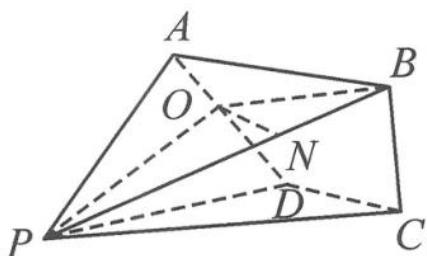

> [!faq]- 《高中数学新体系·向量的秘密》例题解析
>
> > [!success]- **【答案】** 详见解析
>
> > [!note]- **【分析】**
> > 本题的难点在于没有现成的空间直角坐标系,对立体几何空间感觉较弱的同学,有一定的难度.
>
> > [!note]- **【解析】**
> > 解答 取 $\overrightarrow{AP}=a,\overrightarrow{AD}=b,\overrightarrow{AB}=c$ 为一组基底向量，由条件知 $|a|=|b|=|c|=2$ ，且
> > $$
> > \boldsymbol {a} \cdot \boldsymbol {b} = 2, \boldsymbol {a} \cdot \boldsymbol {c} = - \frac {1}{2}, \boldsymbol {b} \cdot \boldsymbol {c} = 4 \cos \theta .
> > $$
> > (1) 因为 $\overrightarrow{BP} = \overrightarrow{AP} - \overrightarrow{AB} = a - c$ ，由 $AD \perp BP$ 知 $(a - c) \cdot b = 0$ ，即 $a \cdot b = b \cdot c = 2$ ，所以 $\cos \theta = \frac{1}{2}$ ，即 $\theta = \frac{\pi}{3}$ . 所以，直角梯形 $ABCD$ 的底角 $\angle BAD = \frac{\pi}{3}$ ，故 $|BC| = \sqrt{3}$ .
> > (2)要用向量法求线面角的正弦值,即求线向量与平面法向量夹角的余弦值.用基向量如何表示平面的法向量呢?
> > 解法一:结合立体图形的特点,找出平面的法向量.取 AD 的中点 O,从图 11.6-9 中我们很容易看出平面 BOP⊥平面 APD,故作 ON⊥PO,交 PB 于点 N,则 $\overrightarrow{ON}$ 就是平面 APD 的法向量.在 $\triangle POB$ 中,易得 N 为 PB 的三等分点,则
> > 
> > 图11.6-9
> > $$
> > \overrightarrow {O N} = \frac {1}{3} \overrightarrow {O P} + \frac {2}{3} \overrightarrow {O B} = \frac {1}{3} (\overrightarrow {O A} + \overrightarrow {A P}) + \frac {2}{3} (\overrightarrow {O A} + \overrightarrow {A B}) = \frac {1}{3} \left(- \frac {\boldsymbol {b}}{2} + \boldsymbol {a}\right) + \frac {2}{3} \left(- \frac {\boldsymbol {b}}{2} + \boldsymbol {c}\right) = \frac {\boldsymbol {a}}{3} - \frac {\boldsymbol {b}}{2} + \frac {2 \boldsymbol {c}}{3}.
> > $$
> > 所以 $(\overrightarrow{ON})^2 = \left(\frac{a}{3} -\frac{b}{2} +\frac{2c}{3}\right)^2 = 1$ ，故 $|\overrightarrow{ON}| = 1.$ 又 $\overrightarrow{BC} = b - \frac{c}{2}$ ，所以
> > $$
> > \overrightarrow {B C} \cdot \overrightarrow {O N} = \left(\boldsymbol {b} - \frac {\boldsymbol {c}}{2}\right) \cdot \left(\frac {\boldsymbol {a}}{3} - \frac {\boldsymbol {b}}{2} + \frac {2 \boldsymbol {c}}{3}\right) = - \frac {3}{4}.
> > $$
> > 所以 $\sin \alpha = \frac{|\overrightarrow{BC} \cdot \overrightarrow{ON}|}{|\overrightarrow{BC}| |\overrightarrow{ON}|} = \frac{\frac{3}{4}}{\sqrt{3} \times 1} = \frac{\sqrt{3}}{4}$ .
> > 解法二:通过代数运算,设平面 APD 的法向量 $\overrightarrow{MN}=xa+yb+zc$ , 则需满足
> > $$
> > \left\{ \begin{array}{l} \overrightarrow {A P} \cdot \overrightarrow {M N} = \boldsymbol {a} \cdot (x \boldsymbol {a} + y \boldsymbol {b} + z \boldsymbol {c}) = 0, \\ \overrightarrow {A D} \cdot \overrightarrow {M N} = \boldsymbol {b} \cdot (x \boldsymbol {a} + y \boldsymbol {b} + z \boldsymbol {c}) = 0. \end{array} \right.
> > $$
> > 取 $z = 4$ ，则
> > $$
> > \overrightarrow {M N} = 2 \boldsymbol {a} - 3 \boldsymbol {b} + 4 \boldsymbol {c}.
> > $$
> > 同解法一得 $\sin \alpha = \frac{|\overrightarrow{BC} \cdot \overrightarrow{MN}|}{|\overrightarrow{BC}| |\overrightarrow{MN}|} = \frac{\sqrt{3}}{4}$ .
> > 点评 我们可以看到,求解没有现成的空间直角坐标系或者不易建立坐标系的立体几何问题,空间基向量法是个不错的选择.我们可以利用向量基本定理将相关的几何要素表示出来,借助向量运算求出需要的量.这种方法不用添辅助线,用代数的运算来弥补几何的缺失.我们常用的空间直角坐标系法其实是基向量法的一种特殊情况.
