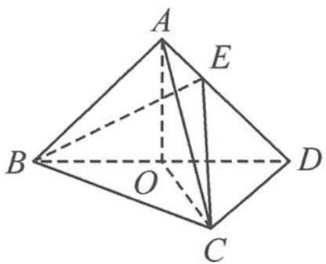

<!-- question-source:start -->
1. 如图, 在三棱锥 $A-BCD$ 中, 已知平面 $ABD \perp$ 平面 $BCD$ , $AB=AD$ , $O$ 为 $BD$ 的中点.

(1) 证明: $OA \perp CD$ .

(2)若 $\triangle OCD$ 是边长为1的等边三角形,点E在棱AD上,DE=2EA,且二面角E-BC-D的大小为 $45^{\circ}$ ,求三棱锥A-BCD的体积.
<!-- question-source:end -->

![[Q00036845A1]]
