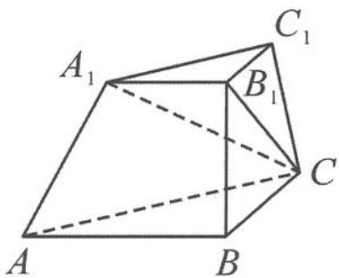

<!-- question-source:start -->
2. 在三棱台 $ABC-A_{1}B_{1}C_{1}$ 中, 已知 $\angle ABC = 90^{\circ}, AB = 2BC = 2B_{1}C$ , 平面 $ABC \perp$ 平面 $A_{1}B_{1}C, B_{1}C$ 与平面 ABC 所成的角为 $60^{\circ}$ .

(1) 证明: $BB_{1} \perp AC$ .

第1题图

(2)求 AC 与平面 $ABB_{1}A_{1}$ 所成角的正弦值.

第2题图
<!-- question-source:end -->

![[Q00036846A1]]
