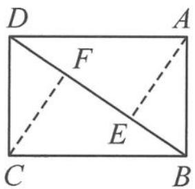
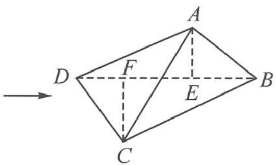

<!-- question-source:start -->
6. 如图, 已知矩形 $ABCD, AB = 1, BC = \sqrt{2}, AE \perp BD$ 于点 $E, CF \perp BD$ 于点 $F$ . 将 $\triangle ABD$ 沿着对角线 $BD$ 翻折, 在翻折的过程中:

(1) $AC$ 的长为多少时, 二面角 $A - BD - C$ 的大小为 $60^{\circ}$ ?

(2)在(1)的条件下,求AB,CD所成角的大小.

图1

图2
第6题图
<!-- question-source:end -->

![[Q00036850A1]]
