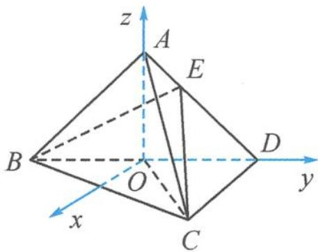

> [!faq]- 《高中数学新体系·向量的秘密》参考答案
>
> > [!success]- **【答案】** 详见解析
>
> > [!note]- **【分析】**
> > 本题未单列分析。
>
> > [!note]- **【解析】**
> > 解答 (1) 因为 $AB = AD, O$ 为 $BD$ 的中点, 所以 $AO \perp BD$ .
> > 因为平面 $ABD \perp$ 平面 $BCD$ , 平面 $ABD \cap$ 平面 $BCD = BD, AO \perp BD$ , 所以 $AO \perp$ 平面 $BCD$ . 又 $CD \subset$ 平面 $BCD$ , 所以 $AO \perp CD$ .
> > (2)如答图,以 O 为原点,过点 O 在平面 BCD 内作 OD 的垂线,以此垂线为 x 轴、直线 OD 为 y 轴、直线 OA 为 z 轴作空间直角坐标系,则 $B(0,-1,0)$ , $C\left(\frac{\sqrt{3}}{2},\frac{1}{2},0\right)$ .
> > 
> > 第1题答图
> > 设 $A(0,0,h)$ ，则 $E\left(0,\frac{1}{3},\frac{2h}{3}\right)$ 设平面 $EBC$ 的一个法向量 $\pmb{n}_1 = (x,y,z)$
> > $\overrightarrow{BE} = \left(0, \frac{4}{3}, \frac{2h}{3}\right), \overrightarrow{BC} = \left(\frac{\sqrt{3}}{2}, \frac{3}{2}, 0\right), \begin{cases} \frac{4}{3}y + \frac{2h}{3}z = 0, \\ \frac{\sqrt{3}}{2}x + \frac{3}{2}y = 0. \end{cases}$ 令 $z = 1$ ，则 $y = -\frac{1}{2}h, x = \frac{\sqrt{3}}{2}h.$ 所以 $n_1 = \left(\frac{\sqrt{3}}{2}h, -\frac{1}{2}h, 1\right)$ . 又平面 $BCD$ 的一个法向量 $n_2 = (0,0,1)$ ，所以 $\frac{1}{\sqrt{\frac{3}{4}h^2 + \frac{1}{4}h^2 + 1}} = \frac{\sqrt{2}}{2}$ ，解得 $h = 1$ . 所以 $V_{A-BCD} = \frac{1}{3} \times \frac{1}{2} \times 2 \times \frac{\sqrt{3}}{2} \times 1 = \frac{\sqrt{3}}{6}$ .
