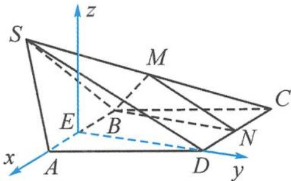

> [!faq]- 《高中数学新体系·向量的秘密》参考答案
>
> > [!success]- **【答案】** 详见解析
>
> > [!note]- **【分析】**
> > 本题未单列分析。
>
> > [!note]- **【解析】**
> > 解答 以点 E 为原点, 直线 EA, ED 分别为 x 轴、y 轴, 过点 E 作 z 轴垂直底面 ABCD, 如答图所示建立空间直角坐标系.
> > 
> > 第 3 题答图
> > 由题意知 $A(1,0,0), B(-1,0,0), C(-2,\sqrt{3},0), D(0,\sqrt{3},0), N(-1,\sqrt{3},0)$ .
> > 设 $S(x,y,z)$ , 由 $SA = SB = 2, SD = 3$ 可知 $\left\{\begin{aligned}&(x-1)^{2}+y^{2}+z^{2}=4,\\&(x+1)^{2}+y^{2}+z^{2}=4,\\&x^{2}+(y-\sqrt{3})^{2}+z^{2}=9,\end{aligned}\right.$ 解得 $x=0, y=-\frac{\sqrt{3}}{2}, z=\frac{3}{2}$ .
> > 所以 $S\left(0,-\frac{\sqrt{3}}{2}, \frac{3}{2}\right), M\left(-1, \frac{\sqrt{3}}{4}, \frac{3}{4}\right)$ .
> > 由 $\overrightarrow{CD}=(2,0,0), \overrightarrow{BM}=(0, \frac{\sqrt{3}}{4}, \frac{3}{4}), \overrightarrow{BN}=(0, \sqrt{3},0)$ ,
> > 可知 $\left\{\begin{aligned}\overrightarrow{CD} \cdot \overrightarrow{BM}=0,\\ \overrightarrow{CD} \cdot \overrightarrow{BN}=0\end{aligned}\right. \Rightarrow \left\{\begin{aligned}\overrightarrow{CD} \perp \overrightarrow{BM},\\ \overrightarrow{CD} \perp \overrightarrow{BN}\end{aligned}\right. \Rightarrow CD \perp$ 平面 $BMN$ .
