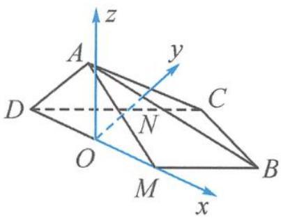

> [!faq]- 《高中数学新体系·向量的秘密》参考答案
>
> > [!success]- **【答案】** 详见解析
>
> > [!note]- **【分析】**
> > 本题未单列分析。
>
> > [!note]- **【解析】**
> > 解答 如答图, 取 DM 的中点 O, 过点 O 作 DM 的垂线, 交 DC 于点 N, 以点 O 为原点, 直线 OM, ON 分别为 x 轴、y 轴, 垂直于平面 BCM 的直线为 z 轴, 如答图所示建立坐标系.
> > 
> > 第4题答图
> > 设 $\angle AON = \theta$ ，则 $B\left(\sqrt{2},\frac{\sqrt{2}}{2},0\right),C\left(\frac{\sqrt{2}}{2},\sqrt{2},0\right)$ $A\left(0,\frac{\sqrt{2}}{2}\cos \theta ,\frac{\sqrt{2}}{2}\sin \theta\right),$ 从而 $\overrightarrow{AB} = \left(\sqrt{2},\frac{\sqrt{2}}{2} -\frac{\sqrt{2}}{2}\cos \theta , - \frac{\sqrt{2}}{2}\sin \theta\right),$ $\overrightarrow{BC} = \left(-\frac{\sqrt{2}}{2},\frac{\sqrt{2}}{2},0\right).$ 设平面 $ABC$ 的一个法向量 $\pmb{n}_{1} = (x,y,z)$ 则 $\left\{ \begin{array}{l}\sqrt{2} x + \frac{\sqrt{2}}{2} y(1 - \cos \theta) - \frac{\sqrt{2}}{2} z\sin \theta = 0,\\ -\frac{\sqrt{2}}{2} x + \frac{\sqrt{2}}{2} y = 0. \end{array} \right.$ 令 $x = y = 1$ ，则 $z = \frac{3 - \cos\theta}{\sin\theta}$ 所以 $\pmb {n}_1 = \left(1,1,\frac{3 - \cos\theta}{\sin\theta}\right).$ 又平面 $BCD$ 的一个法向量 $\pmb{n}_2 = (0,0,1)$ 设二面角 $A - BC - D$ 的平面角为 $\alpha$ $\cos \alpha = \frac{\frac{3 - \cos\theta}{\sin\theta}}{\sqrt{2 + \left(\frac{3 - \cos\theta}{\sin\theta}\right)^2}} = \frac{3 - \cos\theta}{\sqrt{11 - \cos^2\theta - 6\cos\theta}}.$ 令 $t = 3 - \cos \theta ,t\in [2,4]$ $\cos \alpha = \frac{t}{\sqrt{11 - (3 - t)^2 - 6(3 - t)}}$ $= \frac{t}{\sqrt{-t^2 + 12t - 16}} = \frac{1}{\sqrt{-1 + 12\frac{1}{t} - 16\frac{1}{t^2}}}.$ 当 $\frac{1}{t} = \frac{3}{8}$ ，即 $t = \frac{8}{3}$ 时，cosα有最小值，此时$\cos\alpha=\frac{2\sqrt{5}}{5}$ ，所以 $\tan\alpha=\frac{1}{2}$ .
