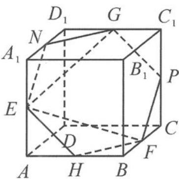

> [!faq]- 《高中数学新体系·向量的秘密》参考答案
>
> > [!success]- **【答案】** 详见解析
>
> > [!note]- **【分析】**
> > 本题未单列分析。
>
> > [!note]- **【解析】**
> > 解答 因为 $\overrightarrow{EM} = x\overrightarrow{EF} + y\overrightarrow{EG}(x, y \in \mathbb{R})$ , 所以点 $M$ 在平面 $EFG$ 上. 如答图, 取 $A_1D_1, AB, CC_1$ 的中点 $N, H, P$ , 则点 $M$ 的轨迹是正六边形 $EHFPGN$ . 轨迹的长度即为正六边形的周长, $l = 6EN = 3\sqrt{2}$ .
> > 
> > 第9题答图
