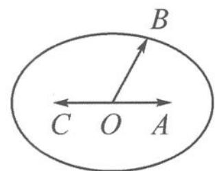

> [!faq]- 《高中数学新体系·向量的秘密》例题解析
>
> > [!success]- **【答案】** 详见解析
>
> > [!note]- **【分析】**
> > 两个模长之和为定值, 不禁令人想起椭圆的第一定义. 那么, 等式 $|a + b| + |a - b|$ = 4 真的表示椭圆吗? 我们不妨作图一试.
>
> > [!note]- **【解析】**
> > 解答 如图 12.1-1, 记 $a = \overrightarrow{OA}, -a = \overrightarrow{OC}, b = \overrightarrow{OB}$ , 则有
> > $$
> > \vert a + b \vert + \vert a - b \vert = \vert - a - b \vert + \vert a - b \vert = \vert \overrightarrow {B C} \vert + \vert \overrightarrow {B A} \vert = 4.
> > $$
> > 
> > 所以,动点 B 在图中的椭圆上运动.椭圆的焦距 AC=2c=2,长轴 $2a=|BC|+|BA|=4$ ,短半轴 $b=\sqrt{3}$ .从而
> > 图12.1-1
> > $$
> > | \boldsymbol {b} | = | \overrightarrow {O B} | \in [ \sqrt {3}, 2 ].
> > $$
> > 点评 两个模长之和为定值,与椭圆的第一定义完美契合.要作出椭圆还需克服 $|\overrightarrow{OA} + \overrightarrow{OB}|$ 的作图困难,巧妙地构造 $\overrightarrow{OA}$ 的相反向量 $\overrightarrow{OC}$ ,使得 $|\overrightarrow{OA} + \overrightarrow{OB}| = |- \overrightarrow{OC} + \overrightarrow{OB}| = |\overrightarrow{CB}|$ .暗藏的椭圆呼之欲出.
