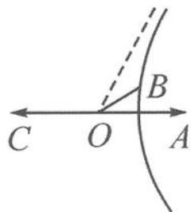

> [!faq]- 《高中数学新体系·向量的秘密》例题解析
>
> > [!success]- **【答案】** 详见解析
>
> > [!note]- **【分析】**
> > 两个模长之差为定值, 不禁令人想起双曲线的第一定义. 那么, 等式 $|e_1 + \lambda e_2| - |e_1 - \lambda e_2| = 1$ 真的表示双曲线吗? 我们可以类比例 1 进行作图.
>
> > [!note]- **【解析】**
> > 解答 如图 12.1-2, 记 $e_{1}=\overrightarrow{OA}, \lambda e_{2}=\overrightarrow{OB}, -e_{1}=\overrightarrow{OC}$ , 则
> > $$
> > \left| \boldsymbol {e} _ {1} + \lambda \boldsymbol {e} _ {2} \right| - \left| \boldsymbol {e} _ {1} - \lambda \boldsymbol {e} _ {2} \right| = \left| - \boldsymbol {e} _ {1} - \lambda \boldsymbol {e} _ {2} \right| - \left| \boldsymbol {e} _ {1} - \lambda \boldsymbol {e} _ {2} \right| = | B C | - | B A | = 1.
> > $$
> > 
> > 所以, 点 B 在以 A, C 为焦点的双曲线的右支上. 双曲线的实轴 2a = 1, 焦距 2c = 2.
> > 图12.1-2
> > 因为 $\lambda\geqslant\frac{\sqrt{6}}{4}$ ，所以 $|OB|\geqslant\frac{\sqrt{6}}{4}$ .
> > 由图知，当 $|OB| = \frac{\sqrt{6}}{4}$ 时， $e_1$ 与 $e_2$ 的夹角最小；当 $|OB| \to +\infty$ 时， $e_1$ 与 $e_2$ 的夹角最大.
> > - **①**：当 $|OB| = \frac{\sqrt{6}}{4}$ 时，联立圆 $x^{2} + y^{2} = \left(\frac{\sqrt{6}}{4}\right)^{2}$ 与双曲线 $\frac{x^2}{\frac{1}{4}} -\frac{y^2}{\frac{3}{4}} = 1$ ，得 $B\left(\frac{3}{4\sqrt{2}},\pm \frac{\sqrt{3}}{4\sqrt{2}}\right)$ .此时
> > $\tan \angle AOB = \frac{\sqrt{3}}{3}$ , 即 $\langle e_1, e_2 \rangle_{\min} = \frac{\pi}{6}$ .
> > - **②**：当 $|OB|\rightarrow+\infty$ 时, $e_{1}$ 与 $e_{2}$ 的夹角趋向于渐近线的倾斜角 $\frac{\pi}{3}$ .
> > 综上， $\langle e_{1},e_{2}\rangle\in\left[\frac{\pi}{6},\frac{\pi}{3}\right)$ .
> > 点评 两个模长之差为定值,与双曲线的第一定义相契合,本题与例1如出一辙.
