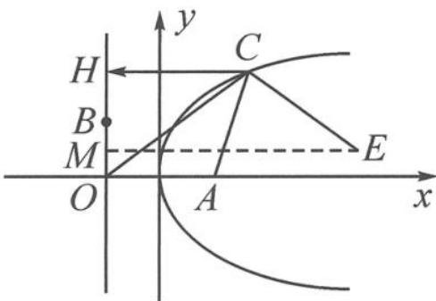

> [!faq]- 《高中数学新体系·向量的秘密》例题解析
>
> > [!success]- **【答案】** 详见解析
>
> > [!note]- **【分析】**
> > “以大换小”, 画出向量, 将向量的代数语言翻译成几何语言, 问题随之明朗.
>
> > [!note]- **【解析】**
> > 解答 记 $a=\overrightarrow{OA}, b=\overrightarrow{OB}, c=\overrightarrow{OC}$ ，过点 C 作 $CH \perp OB$ ，交直线 OB 于点 H.
> > $|c+tb|=|c-(-tb)|$ ，对任意 $t\in R,|c+tb|$ 的最小值为 $|CH|$ ，即 $|CH|=|CA|$ .
> > 
> > 故点 C 的轨迹是以 A 为焦点, 直线 OB 为准线的抛物线, 不妨建
> > 图12.1-3
> > 立如图 12.1-3 所示的直角坐标系, 设 $O(-1,0)$ , $A(1,0)$ , $B(-1,1)$ , 则准线方程为 x = -1.
> > 记 $2a + \frac{b}{2} = \overrightarrow{OE} = (4, \frac{1}{2})$ ，则 $E(3, \frac{1}{2})$ ，过点 $E$ 作 $EM$ 垂直于直线 $x = -1$ ，垂足为 $M$ ，则
> > $$
> > \left| 2 a + \frac {b}{2} - c \right| + | c - a | = | \overrightarrow {C E} | + | \overrightarrow {A C} | = | \overrightarrow {C E} | + | \overrightarrow {C H} | \geqslant | \overrightarrow {E M} | = 4.
> > $$
> > 故 $\left|2a+\frac{b}{2}-c\right|+|c-a|$ 的最小值为4.
> > 点评 将向量的代数语言翻译成几何语言的关键是将向量的小写字母表示改写成有向线段的大写字母表示. 翻译完成后, 就是一道常见的抛物线载体下的最值问题. 实际上, 这就是一道披着向量时尚外衣的抛物线问题.
