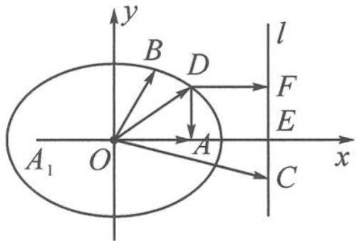

> [!faq]- 《高中数学新体系·向量的秘密》例题解析
>
> > [!success]- **【答案】** 详见解析
>
> > [!note]- **【分析】**
> > “以大换小”, 画出向量, 关键是翻译“对于任意的向量 $d$ 均有 $|d - c|$ 的最小值为 $\sqrt{2} |d - a|$ ”.
>
> > [!note]- **【解析】**
> > 解答 如图 12.1-4, 设 $a = \overrightarrow{OA}, b = \overrightarrow{OB}, c = \overrightarrow{OC}, d = \overrightarrow{OD}$ . 显然, 由 $|a| = |b| = 1, a \cdot b = \frac{1}{2}$ 可知
> > $$
> > | \overrightarrow {O A} | = | \overrightarrow {O B} | = 1, \angle B O A = 6 0 ^ {\circ}.
> > $$
> > 
> > 图12.1-4
> > 由于 $a \cdot c = 2$ ，故 OC 在 OA 上的投影值为 2。过点 C 作 OA 的垂线 l，垂足为 E，则点 E 在射线 OA 上，且 OE = 2。因此，点 C 是直线 l 上的动点。
> > 由于 $|d - c|$ 表示点 $D$ 到直线 $l$ 上的动点 $C$ 的距离, 所以其最小值即为点 $D$ 到直线 $l$ 的距离 $|\overrightarrow{DF}|$ . 从而 $|\overrightarrow{DF}| = \sqrt{2} |\overrightarrow{DA}|$ , 即
> > $$
> > \frac {| \overrightarrow {D A} |}{| \overrightarrow {D F} |} = \frac {\sqrt {2}}{2}.
> > $$
> > 根据椭圆的第二定义可知, 点 D 在以 A 为焦点, l 为准线的椭圆上. 由于 $\frac{a^{2}}{c}-c=1,\frac{c}{a}=\frac{\sqrt{2}}{2}$ , 所以
> > $$
> > a = \sqrt {2}, c = 1, b = 1.
> > $$
> > 为了表述方便,我们建立以 O 为坐标原点的直角坐标系,则椭圆方程为
> > $$
> > \frac {x ^ {2}}{2} + y ^ {2} = 1.
> > $$
> > 设椭圆的另一个焦点为 $A_{1}$ ，则
> > $$
> > | \boldsymbol {d} - \boldsymbol {a} | + | \boldsymbol {d} - \boldsymbol {b} | = | \overrightarrow {D A} | + | \overrightarrow {D B} | = 2 \sqrt {2} - | D A _ {1} | + | D B |.
> > $$
> > 由“三角形两边之差小于第三边”知
> > $$
> > \mid D B \mid - \mid D A _ {1} \mid \in [ - \mid B A _ {1} \mid , \mid B A _ {1} \mid ] = [ - \sqrt {3}, \sqrt {3} ].
> > $$
> > 因此， $|d - a| + |d - b|$ 的取值范围是 $[2\sqrt{2} -\sqrt{3},2\sqrt{2} +\sqrt{3} ]$
> > 点评 这又是一道披着向量时尚外衣的圆锥曲线问题. 本题的核心是把“对于任意的向量 $d$ , 均有 $|d - c|$ 的最小值为 $\sqrt{2} |d - a|$ ”翻译成椭圆. 这涉及圆锥曲线的第二定义. 若将最小值 $\sqrt{2} |d - a|$ 改为 $\frac{1}{e} |d - a|$ , 则形成的曲线是离心率为 $e$ 的圆锥曲线.
