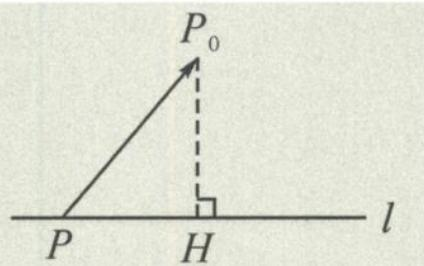

## 12.2 利用向量投影求点到直线的距离

在第 11 讲,我们介绍了在立体几何中利用向量投影变换求点到平面的距离.事实上,在平面解析几何中,这种方法也非常实用.

定义 我们把与直线 l 共线的非零向量 m 称为直线 l 的方向向量, 把与直线 l 方向向量垂直的非零向量 n 称为直线 l 的法向量.

定理 若直线 l 的方程为 $y = kx + b$ ，则向量 $m = (1, k)$ 为其一个方向向量， $n = (k, -1)$ 为其一个法向量。

证明 直线 $y = kx + b$ 的方向与 $b$ 无关, 与直线 $y = kx$ 的方向相同, 取点 (0,0), (1,k) 即可构成一个方向向量 $m = (1,k)$ . 从而 $n = (k,-1)$ 为其法向量. 证毕.

推论 若直线 $l$ 的方程为 $Ax + By + C = 0 (A^2 + B^2 \neq 0)$ , 则向量 $m = (-B, A)$ 为其一个方向向量, $n = (A, B)$ 为其一个法向量.

点到直线的距离 如图12.2-1, 设 $P$ 为直线 $l$ 上的任意一点, $P_0$ 为直线 $l$ 外一点, 过点 $P_0$ 作 $P_0H \perp l$ , 交直线 $l$ 于点 $H$ . 记直线 $l$ 的单位法向量 $\boldsymbol{n} = \frac{\overrightarrow{P_0H}}{|P_0H|}$ , 则点 $P_0$ 到直线 $l$ 的距离 $|P_0H| = |\overrightarrow{PP_0} \cdot \boldsymbol{n}|$ . 故点 $P_0$ 到直线 $l$ 的距离等于向量 $\overrightarrow{PP_0}$ 在直线 $l$ 单位法向量上的投影向量的模长.

图12.2-1

![[高中/总复习/专题/高考数学秘密/浙大优辅《高中数学新体系 向量的秘密》/第12讲_表示与转化__向量与解析几何/12_2_利用向量投影求点到直线的距离/questions/Q00036859.md]]
![[高中/总复习/专题/高考数学秘密/浙大优辅《高中数学新体系 向量的秘密》/第12讲_表示与转化__向量与解析几何/12_2_利用向量投影求点到直线的距离/questions/Q00036860.md]]
