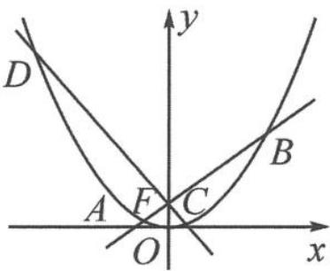

<!-- question-source:start -->
例 2 如图 12.2-2, 已知抛物线 $x^{2}=2py(p>0)$ 的焦点为 $F(0,1)$ . 过点 F 的两条动直线 $l_{1}, l_{2}$ 分别交抛物线于 A, B, C, D 四点. 记直线 AB 的斜率为 $k_{1}$ , 直线 CD 的斜率为 $k_{2}$ , 且 $k_{1}-k_{2}=2$ . 求四边形 ACBD 面积的最小值.

<!-- question-source:end -->

![[高中/总复习/专题/高考数学秘密/浙大优辅《高中数学新体系 向量的秘密》/第12讲_表示与转化__向量与解析几何/12_2_利用向量投影求点到直线的距离/questions/answers/Q00036860A1.md]]
