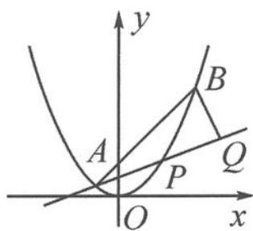

<!-- question-source:start -->
例 1 如图 12.3-1, 已知抛物线 $y = x^{2}$ , 点 $A\left(-\frac{1}{2}, \frac{1}{4}\right)$ , $B\left(\frac{3}{2}, \frac{9}{4}\right)$ , 抛物线上的点 $P(x, y)\left(-\frac{1}{2} < x < \frac{3}{2}\right)$ . 过点 B 作直线 AP 的垂线, 垂足为 Q. 求 $|PA||PQ|$ 的最大值.

图12.3-1
<!-- question-source:end -->

![[高中/总复习/专题/高考数学秘密/浙大优辅《高中数学新体系 向量的秘密》/第12讲_表示与转化__向量与解析几何/12_3_利用向量投影求线段的长度/questions/answers/Q00036861A1.md]]
