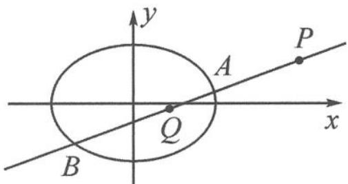

<!-- question-source:start -->
例 1 如图 12.4-1, 设椭圆 $C: \frac{x^{2}}{4} + \frac{y^{2}}{2} = 1$ , 过点 $P(4,1)$ 的直线 $l$ 与椭圆 $C$ 交于 $A, B$ 两点, 在线段 $AB$ 上取点 $Q$ , 满足 $|\overrightarrow{AP}| |\overrightarrow{BQ}| = |\overrightarrow{AQ}| |\overrightarrow{PB}|$ . 证明: 点 $Q$ 总在某条定直线上.

图12.4-1
<!-- question-source:end -->

![[高中/总复习/专题/高考数学秘密/浙大优辅《高中数学新体系 向量的秘密》/第12讲_表示与转化__向量与解析几何/12_4_利用向量刻画三点共线/questions/answers/Q00036863A1.md]]
