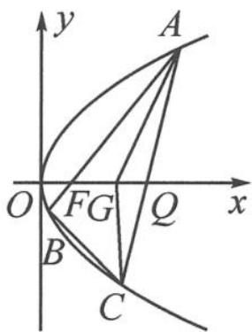

<!-- question-source:start -->
例 2 如图 12.4-2, 过焦点 $F(1,0)$ 的直线与抛物线 $y^{2}=4x$ 交于 $A, B$ 两点, 点 $C$ 在抛物线上, 使得 $\triangle ABC$ 的重心 $G$ 在 $x$ 轴上, 直线 $AC$ 交 $x$ 轴于点 $Q$ (点 $Q$ 在点 $F$ 的右侧). 记 $\triangle AFG$ , $\triangle CQG$ 的面积分别为 $S_{1}, S_{2}$ . 求 $\frac{S_{1}}{S_{2}}$ 的最小值.

<!-- question-source:end -->

![[高中/总复习/专题/高考数学秘密/浙大优辅《高中数学新体系 向量的秘密》/第12讲_表示与转化__向量与解析几何/12_4_利用向量刻画三点共线/questions/answers/Q00036864A1.md]]
