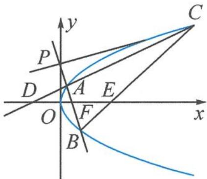

<!-- question-source:start -->
例 2 如图 12.6-1, 设 $P(0, t)$ , $t \in R$ , 已知 F 是抛物线 $y^{2} = 4x$ 的焦点, 直线 PF 与抛物线交于 A, B 两点 (AF < BF). 过点 P 作抛物线的切线 PC, 与抛物线相切于点 C. 直线 CA, CB 分别与 x 轴交于点 D, E. 记 $\triangle ADF$ , $\triangle BEF$ , $\triangle ABC$ 的面积分别为 $S_{1}$ , $S_{2}$ , S. 求 $\frac{S_{1}S_{2}}{S^{2}}$ 的最大值.

图12.6-1
<!-- question-source:end -->

![[高中/总复习/专题/高考数学秘密/浙大优辅《高中数学新体系 向量的秘密》/第12讲_表示与转化__向量与解析几何/12_6_三角形面积公式的向量形式/questions/answers/Q00036868A1.md]]
