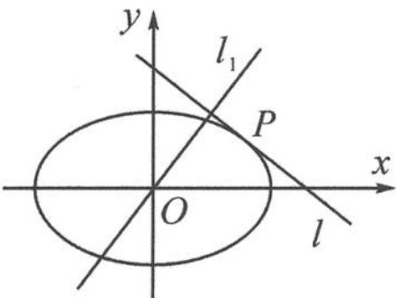

<!-- question-source:start -->
4. 如图, 已知椭圆 $C: \frac{x^{2}}{a^{2}} + \frac{y^{2}}{b^{2}} = 1 (a > b > 0)$ , 动直线 $l$ 与椭圆 $C$ 只有一个公共点 $P$ , 且点 $P$ 在第一象限. 过原点 $O$ 的直线 $l_{1}$ 与 $l$ 垂直, 求点 $P$ 到直线 $l_{1}$ 的距离的最大值 (用 $a, b$ 表示).

第4题图
<!-- question-source:end -->

![[Q00036872A1]]
