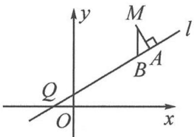

<!-- question-source:start -->
5. 已知 $l$ 是过点 $Q(-1,0)$ 的直线, $M$ 是抛物线 $C: y = \frac{1}{2} (x^2 + x)$ 上 (不在 $l$ 上) 的动点. 点 $A, B$ 在直线 $l$ 上, $MA \perp l$ , $MB \perp x$ 轴 (如图). 求出直线 $l$ 的方程, 使得 $\frac{|QB|^2}{|QA|}$ 为常数.

第5题图
<!-- question-source:end -->

![[Q00036873A1]]
