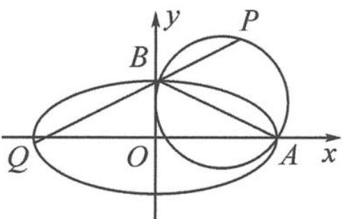

<!-- question-source:start -->
7. 如图, 已知椭圆 $\frac{x^{2}}{4} + y^{2} = 1$ , 若点 $A$ 是椭圆的右顶点, $B$ 是椭圆的上顶点, 点 $P(x_{0}, y_{0}) (y_{0} > 1)$ 在以 $AB$ 为直径的圆上, 延长 $PB$ , 交椭圆 $E$ 于点 $Q$ . 求 $|BP||BQ|$ 的最大值.

第 7 题图
<!-- question-source:end -->

![[Q00036875A1]]
