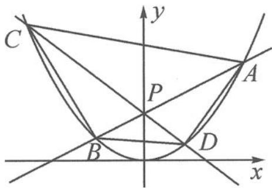

<!-- question-source:start -->
10. 如图, 过点 $P(0,2)$ 的直线 $AB, CD$ 分别交抛物线 $x^{2}=4y$ 于 $A, B, C, D$ 四点. 记直线 $AB$ 的斜率为 $k_{1}$ , 直线 $CD$ 的斜率为 $k_{2}$ , 且 $k_{1}k_{2}=-\frac{3}{4}$ . 求四边形 $ACBD$ 面积的最小值.

第10题图
<!-- question-source:end -->

![[Q00036878A1]]
