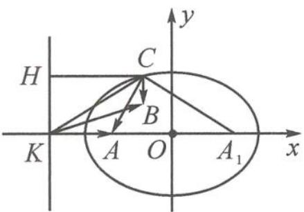

> [!faq]- 《高中数学新体系·向量的秘密》参考答案
>
> > [!success]- **【答案】** 详见解析
>
> > [!note]- **【分析】**
> > 本题未单列分析。
>
> > [!note]- **【解析】**
> > 解答 设 $a=\overrightarrow{KA}, b=\overrightarrow{KB}, c=\overrightarrow{KC}$ .
> > 根据题目的条件 $|a|=1, |b|=\frac{\sqrt{10}}{2}, a \cdot b=\frac{3}{2}$ , 点 $A, B$ 的相对位置是确定的.
> > 现在的关键是分析点 $C$ 的运动.
> > 设 $\langle a, c \rangle=\theta$ , 由 $a \cdot c=\sqrt{2}|a||c-a|$ 得 $|\overrightarrow{KA}||\overrightarrow{KC}|\cos\theta=\sqrt{2}|\overrightarrow{KA}||\overrightarrow{AC}|$ .
> > 故 $|\overrightarrow{KC}|\cos\theta=\sqrt{2}|\overrightarrow{AC}|$ .
> > 
> > 第2题答图
> > 如答图, 若过点 K 作 KA 的垂线 l, 过点 C 作 l
> > 的垂线,垂足为 H,
> > 则 $|\overrightarrow{KC}|\cos \theta = |\overrightarrow{CH}| = \sqrt{2} |\overrightarrow{AC}|$
> > 即 $\frac{|\overrightarrow{AC}|}{|\overrightarrow{CH}|}=\frac{\sqrt{2}}{2}.$
> > 故点 C 到点 A 的距离与点 C 到直线 l 的距离之比为 $\frac{\sqrt{2}}{2}$ .
> > 因此，点 $C$ 的轨迹是以 $A$ 为焦点， $l$ 为准线的椭圆。设椭圆的长轴长为 $2a$ ，焦距为 $2c$ ，
> > 则 $\frac{a^2}{c} - c = 1, \frac{c}{a} = \frac{\sqrt{2}}{2}$ 。
> > 解得 $a = \sqrt{2}, c = 1$ 。
> > 我们建立以 $2\overrightarrow{KA} = \overrightarrow{KO}$ 的点 $O$ 为原点的坐标系，则椭圆的方程为 $\frac{x^2}{2} + y^2 = 1$ 。
> > 由 $|a| = 1, |b| = \frac{\sqrt{10}}{2}, a \cdot b = \frac{3}{2}$ 得点 $B\left(-\frac{1}{2}, \frac{1}{2}\right)$ 。
> > 因此 $\sqrt{2}|c - a| + |c - b| = \sqrt{2}|\overrightarrow{CA}| + |\overrightarrow{CB}| = |\overrightarrow{CH}| + |\overrightarrow{CB}|$ 的最小值即为点 $B$ 到直线 $l$ 的距离。
> > 故 $\sqrt{2}|c - a| + |c - b|$ 的最小值为 $\frac{3}{2}$ 。
