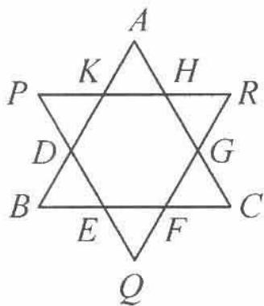

<!-- question-source:start -->
例 2 两个全等的正三角形 ABC 与 PQR 如图 1.1-2 所示, 使得 D, E, F, G, H, K 分别是两个三角形各边的三等分点. 设 $\triangle ABC$ 的边长为 3a, 在所有以 A, B, C, D, E, F, G, H, K, P, Q, R 中任意两个点为端点, 长度为 a 的向量中, 问:

(1)与 $\overrightarrow{BE}$ 相等的向量有哪几个?

(2)与 $\overrightarrow{BE}$ 的模相等的向量有多少个?

图1.1-2
<!-- question-source:end -->

![[高中/总复习/专题/高考数学秘密/浙大优辅《高中数学新体系 向量的秘密》/第1讲_向量概念与线性运算/1_1_平面向量的概念/questions/answers/Q00036561A1.md]]
