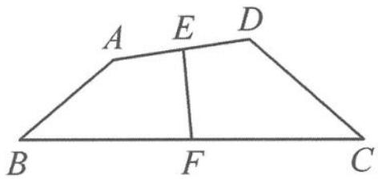

<!-- question-source:start -->
例 3 如图 1.2-5, 在四边形 ABCD 中, E, F 分别是边 AD, BC 的中点, 对角线 $AC = \sqrt{2}$ , $BD = \sqrt{3}$ , 且 EF = 1. 记对角线 AC 与 BD 的夹角为 $\theta$ , 则 $\cos \theta =$ \_\_\_\_.

图1.2-5
<!-- question-source:end -->

![[高中/总复习/专题/高考数学秘密/浙大优辅《高中数学新体系 向量的秘密》/第1讲_向量概念与线性运算/1_2_绕来绕去的向量/questions/answers/Q00036564A1.md]]
