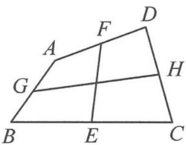

<!-- question-source:start -->
10. 如图, 在四边形 $ABCD$ 中, 已知 $E, F, G, H$ 分别是边 $BC, AD, AB, CD$ 的中点. 证明: $|EF| + |GH| \leqslant \frac{1}{2} (|AB| + |BC| + |CD| + |DA|)$ .

第10题图
<!-- question-source:end -->

![[Q00036577A1]]
