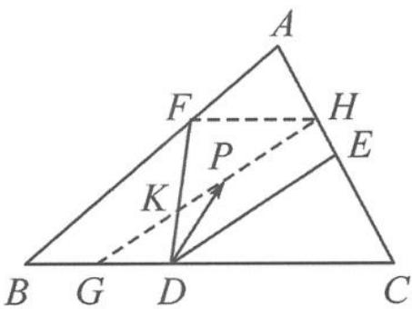

> [!faq]- 《高中数学新体系·向量的秘密》例题解析
>
> > [!success]- **【答案】** 详见解析
>
> > [!note]- **【分析】**
> > 本题未单列分析。
>
> > [!note]- **【解析】**
> > 解答 如图 2.3-3, 取线段 BD 的中点 G, 则
> > $$
> > \overrightarrow {D G} = - \frac {1}{3} \overrightarrow {D C}.
> > $$
> > 
> > 过点 G 作 $GH \parallel DE$ ，交 AC 于点 H，交 DF 于点 K。因为 $\overrightarrow{DP} = -\frac{1}{3}\overrightarrow{DC} + x\overrightarrow{DE}$ ，所以点 P 在线段 KH（不含端点）上运动，且 $x \in \left(\frac{GK}{DE}, \frac{GH}{DE}\right)$ 。
> > 图2.3-3
> > 设 CE=m，在△CGH 中，由相似得 $\frac{CE}{HE}=\frac{CD}{DG}=3$ ，得 $HE=\frac{1}{3}m, AH=\frac{2}{3}m.$
> > 所以 $\frac{AH}{CH} = \frac{1}{2} = \frac{AF}{BF}$ , 得 $FH \parallel BC$ , 所以 $\frac{GK}{KH} = \frac{GD}{FH} = \frac{3}{5}$ .
> > 设 $GK = 3n, KH = 5n$ ，则 $DE = \frac{3}{4} GH = \frac{3}{4} \times 8n = 6n$ .
> > 则 $\frac{GK}{DE} = \frac{1}{2},\frac{GH}{DE} = \frac{HC}{CE} = \frac{\frac{4}{3}m}{m} = \frac{4}{3}$ 所以 $x\in \left(\frac{1}{2},\frac{4}{3}\right)$
> > 点评 本题多次利用平面几何相似的知识求线段长度之比.
