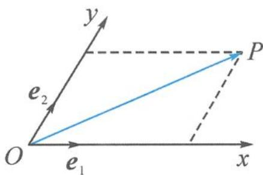

<!-- question-source:start -->
例 1 如图 2.6-1, 设 Ox, Oy 是平面内相交成 $60^{\circ}$ 的两条数轴, $e_{1}, e_{2}$ 分别是与 x 轴、y 轴正方向同向的单位向量. 若向量 $\overrightarrow{OP} = xe_{1} + ye_{2}$ , 则把有序数对 $(x, y)$ 叫作向量 $\overrightarrow{OP}$ 在坐标系 xOy 中的坐标. 设 $\overrightarrow{OP} = 3e_{1} + 2e_{2}$ .

(1) 计算 $\left|\overrightarrow{OP}\right|$ 的大小.

图2.6-1

(2)根据平面向量基本定理,判断本题中对向量坐标的规定是否合理.
<!-- question-source:end -->

![[高中/总复习/专题/高考数学秘密/浙大优辅《高中数学新体系 向量的秘密》/第2讲_向量大厦的基石__平面向量基本定理/2_6_斜基底系下的坐标向量/questions/answers/Q00036590A1.md]]
