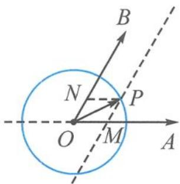
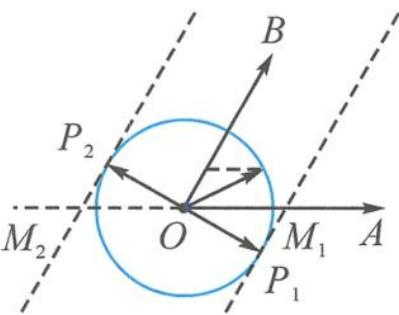

> [!faq]- 《高中数学新体系·向量的秘密》参考答案
>
> > [!success]- **【答案】** 详见解析
>
> > [!note]- **【分析】**
> > 本题未单列分析。
>
> > [!note]- **【解析】**
> > 解答 $|\overrightarrow{OP}| = 1$ , 即点 P 在单位圆上运动.
> > 如答图 1, 过点 P 作 OB, OA 的平行线, 分别交 OA, OB 于点 M, N,
> > 则 $\overrightarrow{OP} = \overrightarrow{OM} + \overrightarrow{ON} = \lambda \overrightarrow{OA} + \mu \overrightarrow{OB}$ .
> > 所以 $\lambda$ 具有明显的几何意义, 即 $|\lambda| = \frac{|\overrightarrow{OM}|}{|\overrightarrow{OA}|} = \frac{|\overrightarrow{OM}|}{2}$ , $\lambda$ 的正负由 $\overrightarrow{OM}$ 与 $\overrightarrow{OA}$ 同向还是反向决定.
> > 
> > 
> > 第6题答图1
> > 第6题答图2
> > 如答图2，当 $PM$ 恰为圆的切线时， $\left|\overrightarrow{OM}\right|_{\max}$ $= \frac{2\sqrt{3}}{3}.$ 故 $-\frac{\sqrt{3}}{3}\leqslant \lambda \leqslant \frac{\sqrt{3}}{3}.$
> > ##
