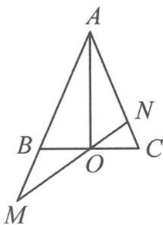

> [!faq]- 《高中数学新体系·向量的秘密》例题解析
>
> > [!success]- **【答案】** 详见解析
>
> > [!note]- **【分析】**
> > 本题图形中有几组三点共线？分别如何用向量刻画？
> >
> > ①A,B,M三点共线,可用条件 $\overrightarrow{AM}=m\overrightarrow{AB}$ 刻画;
> >
> > 
> > 图3.1-1
> >
> > ②A,N,C三点共线,可用条件 $\overrightarrow{AN}=n\overrightarrow{AC}$ 刻画;
> >
> > ③B,O,C三点共线,用什么向量式刻画?
> >
> > ④M,O,N三点共线,用什么向量式刻画?
> >
> > 注意到图中 BC 与 MN 相交于点 O，形成了一个“X”形，故对点 O 而言，有两组三点共线与之相关，因此可以“算两次”。
>
> > [!note]- **【解析】**
> > 解答 因为 O 是 BC 的中点, 所以
> > $$
> > \overrightarrow {A O} = \frac {1}{2} \overrightarrow {A B} + \frac {1}{2} \overrightarrow {A C}.
> > $$
> > 因为 $\overrightarrow{AM} = m\overrightarrow{AB},\overrightarrow{AN} = n\overrightarrow{AC}$ ，所以
> > $$
> > \overrightarrow {A O} = \frac {1}{2 m} \overrightarrow {A M} + \frac {1}{2 n} \overrightarrow {A N}.
> > $$
> > 又 $O, M, N$ 三点共线，故 $\frac{1}{2m} + \frac{1}{2n} = 1$ ，即
> > $$
> > \frac {1}{m} + \frac {1}{n} = 2.
> > $$
> > 点评 本题的几何图形中蕴含了四组三点共线,尤其是“X”形的两组三点共线,提供 $\overrightarrow{AO}$ 的两种表示方式,将几何的“图形”变成了代数的“表示”,让几何问题变得简洁明了.
