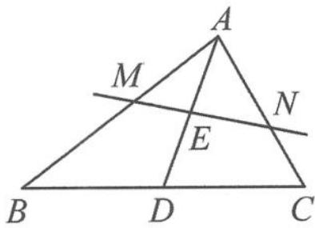
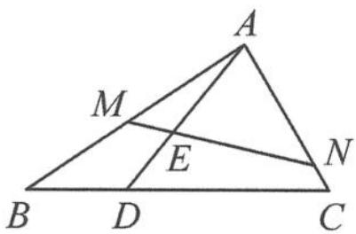
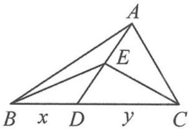

> [!faq]- 《高中数学新体系·向量的秘密》例题解析
>
> > [!success]- **【答案】** 详见解析
>
> > [!note]- **【分析】**
> > 本题未单列分析。
>
> > [!note]- **【解析】**
> > 解答 由题意得 $\overrightarrow{AD} = \frac{\overrightarrow{AB} + \overrightarrow{AC}}{2}$ , 即
> > 
> > 图3.1-2
> > $$
> > 2 \overrightarrow {A E} = \frac {1}{2 x} \overrightarrow {A M} + \frac {1}{2 y} \overrightarrow {A N}.
> > $$
> > 由 $M, N, E$ 三点共线知
> > $$
> > \frac {1}{4 x} + \frac {1}{4 y} = 1.
> > $$
> > 易知 $x, y > 0$ ，故 $x + 4y = (x + 4y)\left(\frac{1}{4x} + \frac{1}{4y}\right) \geqslant \frac{9}{4}$ ，当 $x = \frac{3}{4}, y = \frac{3}{8}$ 时可取等号.
> > 探究 本题中呈现的是三点共线“X”形图, 如果点 D, E 都是任意变化的, 那么你能推导出什么更一般的结论吗?
> > 如图 3.1-3, 在 $\triangle ABC$ 中, $D$ 为 $BC$ 上一点, 且 $\frac{BD}{DC}=\frac{a}{b}$ , $E$ 为 $AD$ 上一点, 过点 $E$ 的直线与线段 $AB$ , $AC$ 分别交于点 $M$ , $N$ . 设 $\overrightarrow{AM}=x\overrightarrow{AB}, \overrightarrow{AN}=y\overrightarrow{AC}, \overrightarrow{AE}=z\overrightarrow{AD}$ , 则 $\frac{b}{x}+\frac{a}{y}=\frac{a+b}{z}$ .
> > 
> > 图3.1-3
> > 
> > 图3.1-4
> > 类似地,在平面几何中,如图 3.1-4,在 $\triangle ABC$ 中, $D$ 为 $BC$ 上一点, $E$ 为 $AD$ 上一点.设 $BD=x,DC=y$ ,则
> > $$
> > \frac {S _ {\triangle A B E}}{S _ {\triangle A E C}} = \frac {S _ {\triangle B E D}}{S _ {\triangle D E C}} = \frac {S _ {\triangle A B D}}{S _ {\triangle A D C}} = \frac {B D}{D C} = \frac {x}{y}.
> > $$
> > 用向量可以表示: 若 E 为 $\triangle ABC$ 内一点, $S_{B}, S_{C}, S$ 分别表示 $\triangle AEC, \triangle AEB, \triangle ABC$ 的面积. 因为 $\overrightarrow{AE} = \frac{AE}{AD} \overrightarrow{AD}$ , 且 $\overrightarrow{AD} = \frac{y}{x + y} \overrightarrow{AB} + \frac{x}{x + y} \overrightarrow{AC} = \frac{S_{\triangle ACD}}{S} \overrightarrow{AB} + \frac{S_{\triangle ABD}}{S} \overrightarrow{AC}$ , 所以
> > $$
> > \overrightarrow {A E} = \frac {S _ {B}}{S} \overrightarrow {A B} + \frac {S _ {C}}{S} \overrightarrow {A C}.
> > $$
