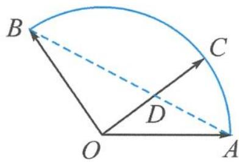
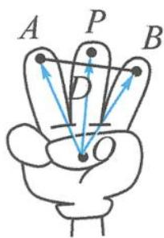

> [!faq]- 《高中数学新体系·向量的秘密》例题解析
>
> > [!success]- **【答案】** 详见解析
>
> > [!note]- **【分析】**
> > 题干给出了向量表示式 $\overrightarrow{OC}=x\overrightarrow{OA}+y\overrightarrow{OB}$ ，要求系数和 $x+y$ 的值。如果C,A,B三点共线，那就完美了。但显然这三点不共线，于是要创造出三点共线。
>
> > [!note]- **【解析】**
> > 解答 如图 3.3-1, 连接 AB, 记 AB 与 OC 交于点 D, 则形成了一个 “X”形图. 因为 O, D, C 三点共线, 所以 $\overrightarrow{OD} = m \overrightarrow{OC}$ . 又因为 $\overrightarrow{OC} = x \overrightarrow{OA} + y \overrightarrow{OB}$ , 故
> > $$
> > \overrightarrow {O D} = m \overrightarrow {O C} = m x \overrightarrow {O A} + m y \overrightarrow {O B}.
> > $$
> > 
> > 图3.3-1
> > 又因为 A, B, D 三点共线，故 $mx + my = 1$ ，得
> > $$
> > x + y = \frac {1}{m}.
> > $$
> > 思考: $\frac{1}{m}$ 有什么意义?
> > m 是我们引入的参数, 刻画的是 $\left|\overrightarrow{OD}\right|$ 与 $\left|\overrightarrow{OC}\right|$ 的比值. 故 $x + y = \frac{1}{m} = \frac{\left|\overrightarrow{OC}\right|}{\left|\overrightarrow{OD}\right|} = \frac{1}{\left|\overrightarrow{OD}\right|}(x + y)$ 的大小仅与 $\left|\overrightarrow{OD}\right|$ 的长度有关了), 当且仅当 $OD \perp AB$ 时, $\left|\overrightarrow{OD}\right|_{\min} = \frac{1}{2}$ , 故 $(x + y)_{\max} = 2$ .
> > 回想我们伸出的三根手指,假设三个指尖共线(实际上,正常人的中指最长,与食指、无名指的指尖是不可能共线的).如图3.3-2,我们不妨连接食指与无名指的指尖,与中指产生交点,从而形成“X”形图.
> > 
> > 遇到求向量表达式 $\overrightarrow{OP}=\lambda\overrightarrow{OA}+\mu\overrightarrow{OB}$ 的系数和问题,若A,B,P三点不共线,那么我们就无中生有,作出新的三点共线.
> > 图3.3-2
> > 步骤一:先确保三个向量共起点.
> > 步骤二:作三点共线.取向量 $\overrightarrow{OA},\overrightarrow{OB}$ 的终点A,B的连线AB与OP所在直线的交点D,则A,B,D三点共线.这里的三点共线是作出来的,而不仅仅是由观察得出的,具有一般性.
> > 步骤三:利用两组三点共线,得到系数和的目标式.
