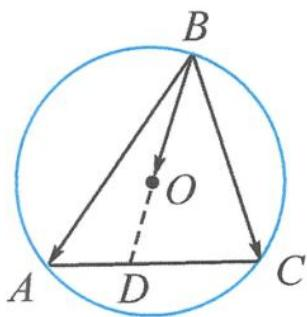

> [!faq]- 《高中数学新体系·向量的秘密》例题解析
>
> > [!success]- **【答案】** D
>
> > [!note]- **【分析】**
> > 题干给出了向量表示式 $\overrightarrow{BO}=\lambda\overrightarrow{BA}+\mu\overrightarrow{BC}$ ，但没有现成的“X”形图.
>
> > [!note]- **【解析】**
> > 解答 如图 3.3-3, 作单位圆 O, 点 B 在圆弧上运动, 保持圆周角 $\angle ABC = 60^{\circ}$ . 延长 BO, 交边 AC 于点 D. 因为 B, O, D 三点共线, 故设 $\overrightarrow{BD} = m \overrightarrow{BO}$ , 则
> > $$
> > \overrightarrow {B D} = m \lambda \overrightarrow {B A} + m \mu \overrightarrow {B C}.
> > $$
> > 
> > 由 $A, C, D$ 三点共线可知
> > $$
> > m \lambda + m \mu = 1.
> > $$
> > 图3.3-3
> > 从而
> > $$
> > \lambda + \mu = \frac {1}{m} = \frac {| \overrightarrow {B O} |}{| \overrightarrow {B D} |} = \frac {| \overrightarrow {B O} |}{| \overrightarrow {B O} | + | \overrightarrow {O D} |} = \frac {1}{1 + | \overrightarrow {O D} |}.
> > $$
> > 显然, 当 $OD \perp AC$ 时, $|\overrightarrow{OD}|$ 取得最小值 $\frac{1}{2}$ , 则 $\lambda + \mu$ 取得最大值 $\frac{2}{3}$ , 此时 $\triangle ABC$ 为等边三角形. 故选 D.
> > 点评 本题需要延长 BO, 交 AC 于点 D, 形成一个“T”形图.
