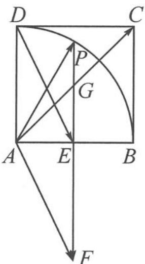
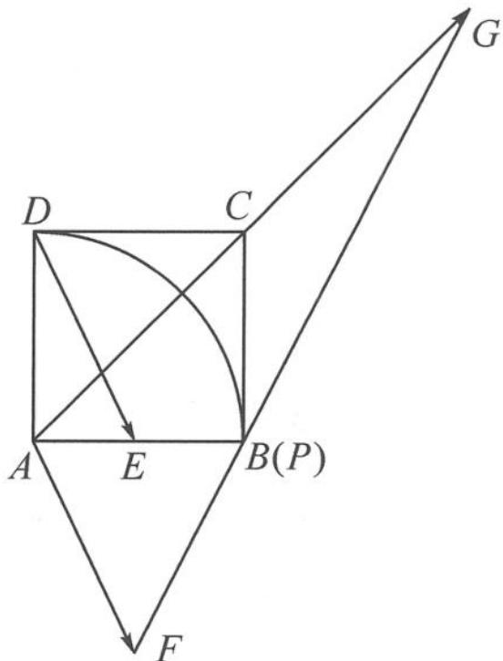

> [!faq]- 《高中数学新体系·向量的秘密》例题解析
>
> > [!success]- **【答案】** 详见解析
>
> > [!note]- **【分析】**
> > 题干给出了向量表示式 $\overrightarrow{AC}=\lambda\overrightarrow{DE}+\mu\overrightarrow{AP}$ ，但三个向量没有共起点。
>
> > [!note]- **【解析】**
> > 解答 如图 3.3-5, 将 $\overrightarrow{DE}$ 平移到 $\overrightarrow{AF}$ , (步骤一: 确保三个向量共起点)
> > 图3.3-4
> > 连接 FP, 交 AC 于点 G. (步骤二: 作出三点共线)
> > 由于 A, G, C 三点共线, 故
> > $$
> > \overrightarrow {A G} = m \overrightarrow {A C} = m \lambda \overrightarrow {A F} + m \mu \overrightarrow {A P}.
> > $$
> > 由于 P, G, F 三点共线, 故 $m\lambda + m\mu = 1$ , 即
> > $$
> > \lambda + \mu = \frac {1}{m} = \frac {| \overrightarrow {A C} |}{| \overrightarrow {A G} |}.
> > $$
> > 因为 $|\overrightarrow{AC}|$ 固定, 故求 $\lambda + \mu$ 的最小值, 即求当点 $P$ 在圆弧上运动时, $|\overrightarrow{AG}|$ 取得的最大值.
> > 
> > 图3.3-5
> > 
> > 图3.3-6
> > 如图 3.3-6, 当点 P 运动到点 B 时, $\left|\overrightarrow{AG}\right|$ 取得的最大值为 $2\left|\overrightarrow{AC}\right|$ , 此时 $\lambda + \mu$ 取得的最小值为 $\frac{1}{2}$ .
