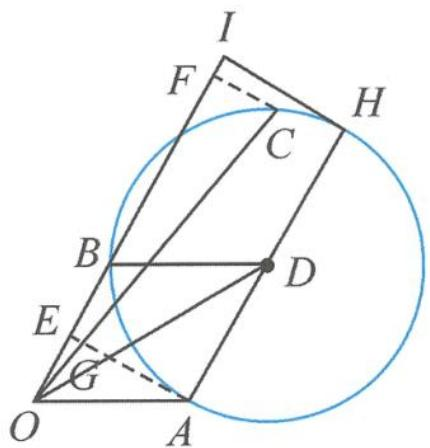
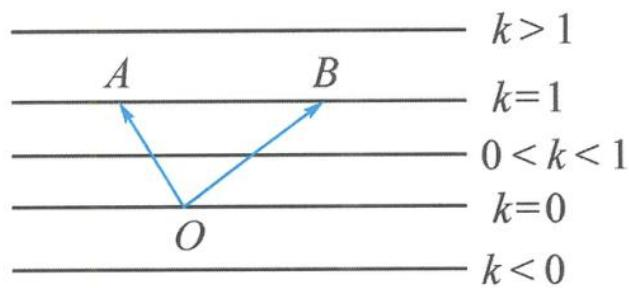

> [!faq]- 《高中数学新体系·向量的秘密》例题解析
>
> > [!success]- **【答案】** 详见解析
>
> > [!note]- **【分析】**
> > 本题未单列分析。
>
> > [!note]- **【解析】**
> > 解答 如图 3.3-7, 作 $a=\overrightarrow{OA}, b=\overrightarrow{OB}, a+b=\overrightarrow{OD}$ . 由 $|c-a-b|=1$ 可知, 点 C 在以 D 为圆心, 1 为半径的圆上.
> > 
> > 图3.3-7
> > $\overrightarrow{OC} = x\overrightarrow{OA} +y\overrightarrow{OB} = x\overrightarrow{OA} +2y\cdot \frac{\overrightarrow{OB}}{2} = x\overrightarrow{OA} +2y\overrightarrow{OE}.$ （其中 $E$ 为 $OB$ 的中点）
> > 因为要求的是系数和 $x + 2y$ ，所以作三点共线.连接 $AE$ ，交 $OC$ 于点 $G$ ，则
> > $$
> > \overrightarrow {O G} = \lambda \overrightarrow {O C} = x \lambda \overrightarrow {O A} + 2 y \lambda \overrightarrow {O E}.
> > $$
> > 由于 A, G, E 三点共线，故 $x\lambda + 2y\lambda = 1$ ，即
> > $$
> > x + 2 y = \frac {1}{\lambda} = \frac {| \overrightarrow {O C} |}{| \overrightarrow {O G} |}.
> > $$
> > 这里又出现了比值,但随着点 C 的运动,这个比值的分子、分母都在变化,不像前面几道例题中比值仅与一个变量相关.怎么办?自然联想到我们曾经在初中学过的平行线分线段成比例.
> > 过点 C 作 $CF \parallel AE$ ，交直线 OB 于点 F。由相似比可知
> > $$
> > x + 2 y = \frac {| \overrightarrow {O C} |}{| \overrightarrow {O G} |} = \frac {| \overrightarrow {O F} |}{| \overrightarrow {O E} |} = 2 | \overrightarrow {O F} |.
> > $$
> > 于是,双变量转为单变量,求 $x+2y$ 的最大值,即求 $\left|\overrightarrow{OF}\right|$ 的最大值.
> > 显然, 当 $HI$ 与圆相切时, $|\overrightarrow{OF}|$ 的最大值为 $|\overrightarrow{OI}| = \frac{5}{2}$ , 所以 $x + 2y$ 的最大值为 5.
> > 点评 在本题的解法中又出现了一条新的辅助线 $CF$ . 有趣的是, 对于直线 $CF$ 上的任意一点 $M$ , 总有 $\overrightarrow{OM} = m\overrightarrow{OA} + n\overrightarrow{OE}$ , 且保持 $m + n = \frac{1}{\lambda} = \frac{|\overrightarrow{OF}|}{|\overrightarrow{OE}|}$ 为定值. 我们一般将这条直线称为等和线. 这是等和线推平行线的由来.
> > 一般地,如图 3.3-8, $O$ 是直线 $A B$ 外一点, 满足 $\overrightarrow { O C } = x \overrightarrow { O A } + y \overrightarrow { O B }, x + y = k$ 为定值的所有点 $C$ 的集合是一条平行于 $A B$ 的直线 $l$ , 称之为等和线, 并满足以下性质:
> > (1) 当 k=0 时, 直线 l 过点 O;
> > (2) 当 $k < 0$ 时, 直线 $l$ 与直线 $A B$ 位于点 $O$ 异侧;
> > (3) 当 0 < k < 1 时, 直线 l 位于点 O 与直线 AB 之间;
> > 
> > (4) 当 k=1 时, 直线 l 即为直线 AB;
> > (5)当 $k > 1$ 时, 直线 $AB$ 位于点 $O$ 与直线 $l$ 之间;
> > 图3.3-8
> > (6)点 O 到直线 l 与到直线 AB 的距离之比为 $\left| k \right|$ .
> > 我们可以看到,等和线是共线定理、三点共线的衍生产物,只有搞懂其原理,才能让那条平行线添得合情合理,顺理成章.
> > 步骤一:先确保三个向量共起点,并按需求配凑系数.
> > 步骤二:确定等值为 1 的直线——基准线;
> > 步骤三:平移直线保证与动点的可行域有交点,分析何处取得最大值和最小值,并利用平面几何知识,计算出最大值或最小值.
> > 这三个步骤与之前作三点共线法的三个步骤异曲同工.
