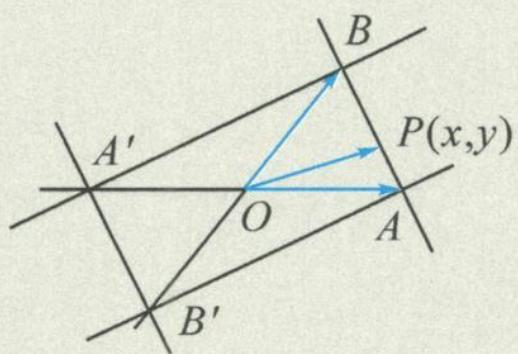
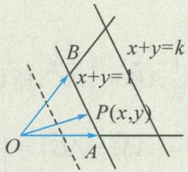
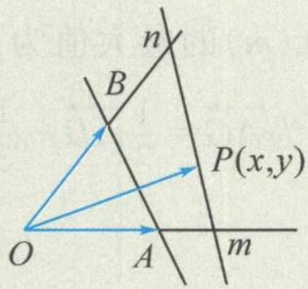

## 3.4 寻根溯源, 直线方程

我们知道向量表示式 $\overrightarrow{OP}=x\overrightarrow{OA}+y\overrightarrow{OB}$ 中的系数x,y以及 $x+y$ 不只是一堆参数,还有着重要的数学意义.第2讲我们已经学习了正交基底下的直角坐标系和斜基底下的斜坐标系,在直角坐标系下, $x+y=1$ 表示过(1,0)和(0,1)的直线,那么在斜坐标系下, $x+y=1$ 又表示什么呢?

结论1 如图3.4-1, 在斜坐标系下, 当且仅当 $P(x, y)$ 位于直线 $AB$ 上时, $(x, y)$ 满足方程 $x + y = 1$ , 即直线 $AB$ 的方程为 $x + y = 1$ . 同理, 直线 $BA', A'B', AB'$ 的方程分别为 $-x + y = 1, -x - y = 1, x - y = 1$ .

结论2 如图3.4-2, 在斜坐标系下, $x + y = k (k \in \mathbb{R})$ 为一族平行直线, 即等和线. 将 $x + y = k$ 写成 $\frac{x}{k} + \frac{y}{k} = 1$ 的形式, 我们就可以类比直角坐标系, 称 $k$ 为直线 $x + y = k$ 在向量 $\overrightarrow{OA}, \overrightarrow{OB}$ 上的“截距”. 因此研究等和线的和值其实就是研究斜坐标系下的“截距”.

图3.4-1

图3.4-2

图3.4-3

一般地,如图 3.4-3, $\frac{x}{m}+\frac{y}{n}=1$ 也表示斜坐标系下的直线截距式方程.

结论3 类比直角坐标系下线性规划中的可行域, 在斜坐标系下, 同样可以画出可行域. 例如 $x + y < k$ 表示直线 $x + y = k$ 的左下部分, $x + y > k$ 表示直线 $x + y = k$ 的右上部分, 依旧遵循“直线定界, 原点定域”的法则.

![[高中/总复习/专题/高考数学秘密/浙大优辅《高中数学新体系 向量的秘密》/第3讲_从向量共线定理到三点共线/3_4_寻根溯源_直线方程/questions/Q00036620.md]]
