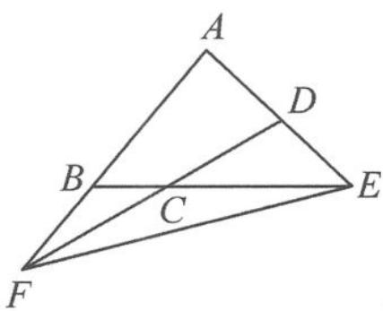

<!-- question-source:start -->
3. (多选)如图, 在凸四边形 $ABCD$ 中, 已知对边 $BC, AD$ 的延长线交于点 $E$ , 对边 $AB, DC$ 的延长线交于点 $F$ . 若 $\overrightarrow{BC} = \lambda \overrightarrow{CE}, \overrightarrow{ED} = \mu \overrightarrow{DA}$ , $\overrightarrow{AB} = 3 \overrightarrow{BF} (\lambda, \mu > 0)$ , 则 ( ). A. $\overrightarrow{EB} = \frac{3}{4} \overrightarrow{EF} + \frac{1}{4} \overrightarrow{EA}$ B. $\lambda \mu = \frac{1}{4}$ C. $\frac{1}{\lambda} + \frac{1}{\mu}$ 的最大值为 4 D. $\frac{\overrightarrow{EC} \cdot \overrightarrow{AD}}{\overrightarrow{EB} \cdot \overrightarrow{EA}} \geqslant -\frac{4}{9}$

第3题图
<!-- question-source:end -->

![[Q00036623A1]]
