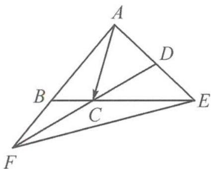

> [!faq]- 《高中数学新体系·向量的秘密》参考答案
>
> > [!success]- **【答案】** ABD
>
> > [!note]- **【分析】**
> > 本题未单列分析。
>
> > [!note]- **【解析】**
> > 解答 因为 $\overrightarrow{AB} = 3\overrightarrow{BF}$ , 所以 $\overrightarrow{EB} - \overrightarrow{EA} = 3(\overrightarrow{EF} - \overrightarrow{EB})$ , 即 $\overrightarrow{EB} = \frac{3}{4}\overrightarrow{EF} + \frac{1}{4}\overrightarrow{EA}$ , 故选项 A 正确. 我们可以在答图中发现一个“X”形 ( $BE \cap FD = C$ ), 故有两组三点共线.
> > 
> > 第3题答图
> > 因为 $\overrightarrow{BC} = \lambda \overrightarrow{CE}$ ，所以 $\overrightarrow{AC} -\overrightarrow{AB} = \lambda (\overrightarrow{AE} -\overrightarrow{AC})$ 即 $\overrightarrow{AC} = \frac{1}{\lambda + 1}\overrightarrow{AB} +\frac{\lambda}{\lambda + 1}\overrightarrow{AE}.$
> > 又因为 D, C, F 三点共线，故将上式继续化简，用 $\overrightarrow{AF}, \overrightarrow{AD}$ 表示，
> > $$
> > \overrightarrow {A C} = \frac {1}{\lambda + 1} \cdot \frac {3}{4} \overrightarrow {A F} + \frac {\lambda}{\lambda + 1} \cdot (1 + \mu) \overrightarrow {A D}.
> > $$
> > 所以 $\frac{1}{\lambda + 1} \cdot \frac{3}{4} + \frac{\lambda}{\lambda + 1} \cdot (1 + \mu) = 1$
> > 化简得 $\lambda\mu=\frac{1}{4}$ ，故选项 B 正确.
> > 因为 $\frac{1}{\lambda} + \frac{1}{\mu} = \frac{1}{\lambda} + 4\lambda$ ，所以有最小值为 4，故选项 C 错误。
> > 因为 $\frac{\overrightarrow{EC} \cdot \overrightarrow{AD}}{\overrightarrow{EB} \cdot \overrightarrow{EA}} = \frac{\overrightarrow{EC} \cdot \overrightarrow{AD}}{-(1 + \lambda)\overrightarrow{EC} \cdot (1 + \mu)\overrightarrow{AD}} = \frac{-1}{(1 + \lambda)(1 + \mu)} = \frac{-1}{1 + \frac{1}{4} + \lambda + \mu} \geqslant \frac{-1}{\frac{5}{4} + 2\sqrt{\lambda\mu}} = -\frac{4}{9}$ , 当且仅当 $\lambda = \mu$ 时取等号, 故选项 D 正确.
> >
> > 故选 **ABD**.
