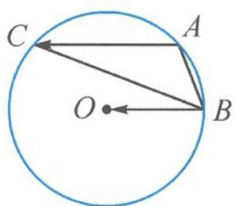

> [!faq]- 《高中数学新体系·向量的秘密》参考答案
>
> > [!success]- **【答案】** 详见解析
>
> > [!note]- **【分析】**
> > 本题未单列分析。
>
> > [!note]- **【解析】**
> > 解答 $\overrightarrow{AO} = \overrightarrow{AB} + k \overrightarrow{AC} \Rightarrow \overrightarrow{BO} = k \overrightarrow{AC}.$ 说明 $\overrightarrow{BO}$ 与 $\overrightarrow{AC}$ 同向共线，即 $BO\parallel AC.$ 如答图, 固定 BO, 则 AC 就是 BO 的平行线.
> > 
> > 第4题答图
> > 设外接圆的半径为 1, 则 $k = \frac{|\overrightarrow{BO}|}{|\overrightarrow{AC}|} = \frac{1}{|\overrightarrow{AC}|}$ $\in \left(\frac{1}{2}, +\infty\right)$ .
