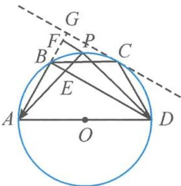

> [!faq]- 《高中数学新体系·向量的秘密》参考答案
>
> > [!success]- **【答案】** 详见解析
>
> > [!note]- **【分析】**
> > 本题未单列分析。
>
> > [!note]- **【解析】**
> > 解答 如答图, 作梯形 ABCD 的外接圆, 点 P 在圆弧 BCD 上运动.
> > 
> > 第5题答图
> > 连接 BD, 交 AP 于点 E, 过点 P 作 PF // BE, 交直线 AB 于点 F.
> > 设 $\overrightarrow{PE}=\lambda\overrightarrow{PA}=\lambda x\overrightarrow{PB}+\lambda y\overrightarrow{PD}$ ,
> > 故 $x + y = \frac{1}{\lambda} = \frac{|\overrightarrow{PA}|}{|\overrightarrow{PE}|} = \frac{|\overrightarrow{AF}|}{|\overrightarrow{BF}|} = \frac{|\overrightarrow{BF}| + |\overrightarrow{AB}|}{|\overrightarrow{BF}|}$ $= 1 + \frac{|\overrightarrow{AB}|}{|\overrightarrow{BF}|}.$
> > 记梯形 ABCD 的外接圆圆心为 O，则 $OC \perp BD$ .
> > 过点 C 作 $CG \parallel BD$ ，交直线 AB 于点 G，CG 为圆的切线.
> > 设 $|AB|=1$ ，则 $|BG|=\frac{1}{2}$ .
> > 故 $x + y = 1 + \frac{1}{|\overrightarrow{BF}|} \geqslant 3$ ，当且仅当点 $P$ 位于点 $C$ 时取到最小值。 $x + y$ 的最小值为 3。
