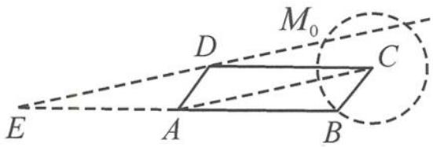

> [!faq]- 《高中数学新体系·向量的秘密》参考答案
>
> > [!success]- **【答案】** 详见解析
>
> > [!note]- **【分析】**
> > 本题未单列分析。
>
> > [!note]- **【解析】**
> > 解答 倍长线段 $BA$ 至点 $E$ , 则 $\overrightarrow{AM} = x\overrightarrow{AB} + y\overrightarrow{AD} = -x\overrightarrow{AE} + y\overrightarrow{AD}$ . 因为 $|\overrightarrow{CM}| = 1$ , 所以点 $M$ 在以 $C$ 为圆心, 1 为半
> > 径的圆弧上运动.
> > 设动直线 l 在四边形 ABCD 所在平面内水平移动, 且 $l \parallel DE, M \in l$ .
> > 容易证明 $AC \parallel DE$ , 故只需直线 $l$ 位于直线 $AC$ 与 $DE$ 之间, 且离 $AC$ 越远, $y - x$ 越大.
> > 如答图,记圆 C 交线段 CD 于点 $M_{0}$ , 则只需 l 经过点 $M_{0}$ , 即点 M 位于点 $M_{0}$ 时, y-x 取最大值.
> > 当点 M 在直线 DE 上时, y - x = 1;
> > 当点 M 在直线 AC 上时, y - x = 0.
> > 故 y - x 的最大值为 $\frac{|M_{0}C|}{|DC|}=\frac{1}{3}$ .
> > 
> > 第6题答图
