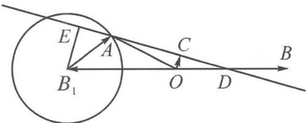

> [!faq]- 《高中数学新体系·向量的秘密》参考答案
>
> > [!success]- **【答案】** 详见解析
>
> > [!note]- **【分析】**
> > 本题未单列分析。
>
> > [!note]- **【解析】**
> > 解答 记 $a = \overrightarrow{OA}, b = \overrightarrow{OB}, c = \overrightarrow{OC}, -b = \overrightarrow{OB_1}$ . 由 $|a + b| = |a - (-b)| = 1$ 得 $|\overrightarrow{B_1A}| = 1$ .
> > 点 A 在以 $B_{1}$ 为圆心, 1 为半径的圆上运动, 如答图.
> > 
> > 第 7 题答图
> > $$
> > \overrightarrow {O C} = \lambda \overrightarrow {O A} + \mu \overrightarrow {O B} = \lambda \overrightarrow {O A} + 2 \mu \frac {\overrightarrow {O B}}{2}.
> > $$
> > 因为 $\lambda+2\mu=1$ ，故点 C 在直线 AD 上运动。
> > 对每一个确定的向量 a，当 $OC \perp AD$ 时， $|c|$ 最小.
> > 作 $B_{1}E \perp AD$ 于点 $E$ ,
> > 由相似得 $\frac{OC}{B_{1}E}=\frac{OD}{B_{1}D}=\frac{1}{3}.$
> > 当 AD 恰好为圆 $B_{1}$ 的切线时, 点 A 与点 E 重合, 故 $\left|B_{1}E\right|$ 取得最大值 1, 故 $\left|OC\right|$ 也取得最大值 $\frac{1}{3}$ , 即 m 的最大值为 $\frac{1}{3}$ .
