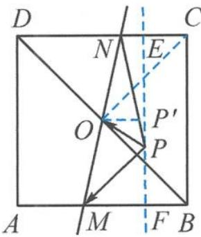

> [!faq]- 《高中数学新体系·向量的秘密》参考答案
>
> > [!success]- **【答案】** 详见解析
>
> > [!note]- **【分析】**
> > 本题未单列分析。
>
> > [!note]- **【解析】**
> > 解答 记 $\overrightarrow{OG} = 2\overrightarrow{OP} = \lambda \overrightarrow{OB} + (1 - \lambda)\overrightarrow{OC}$ , 故 $G, B, C$ 三点共线.
> > 记点 E 是线段 CD 靠近点 C 的四等分点, 如答图.
> > 
> > 第8题答图
> > 点 $F$ 是线段 $AB$ 靠近点 $B$ 的四等分点，故点 $P$ 在直线 $EF$ 上运动.
> > 过点 $O$ 作 $OP' \perp EF$ ，交 $EF$ 于点 $P'$ .
> > 由极化恒等式得 $\overrightarrow{PM} \cdot \overrightarrow{PN} = |\overrightarrow{PO}|^2 - \frac{|\overrightarrow{MN}|^2}{4} \geqslant |\overrightarrow{P'O}|^2 - |\overrightarrow{CO}|^2$ $\geqslant 1^2 - (2\sqrt{2})^2 = -7$ ，即 $\overrightarrow{PM} \cdot \overrightarrow{PN}$ 的最小值是-7.
