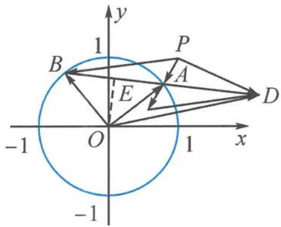

> [!faq]- 《高中数学新体系·向量的秘密》参考答案
>
> > [!success]- **【答案】** 详见解析
>
> > [!note]- **【分析】**
> > 本题未单列分析。
>
> > [!note]- **【解析】**
> > 解答 解法一: 注意到 A, B 是单位圆 $x^{2} + y^{2} = 1$ 上两点, 且 $AB = \sqrt{2}$ , 故 $\angle AOB = \frac{\pi}{2}$ .
> > 设 $A(\cos\theta,\sin\theta), B\left(\cos\left(\theta+\frac{\pi}{2}\right), \sin\left(\theta+\frac{\pi}{2}\right)\right)=B(-\sin\theta,\cos\theta).$ $2\overrightarrow{PA}-\overrightarrow{PB}=2(\cos\theta-1,\sin\theta-1)-(-\sin\theta-1,\cos\theta-1)$ $=(2\cos\theta+\sin\theta-1,2\sin\theta-\cos\theta-1).$ $|2\overrightarrow{PA}-\overrightarrow{PB}|$ $=\sqrt{(2\cos\theta+\sin\theta-1)^{2}+(2\sin\theta-\cos\theta-1)^{2}}$ $=\sqrt{7-6\sin\theta-2\cos\theta}=\sqrt{7-2\sqrt{10}\sin(\theta+\varphi)}$ $\in[\sqrt{5}-\sqrt{2},\sqrt{5}+\sqrt{2}]$ .
> > 解法二:我们不妨来看看要求的向量 $2 \overrightarrow{PA} - \overrightarrow{PB}$ 到底是怎么样的图?
> > 
> > 第9题答图
> > 令 $\overrightarrow{PD} = 2\overrightarrow{PA} -\overrightarrow{PB}$ ，注意到系数和为1，故 $A$ $B,D$ 三点共线，故很容易画出答图中的点 $D,AB =$ $AD = \sqrt{2}$
> > $$
> > O E = \frac {\sqrt {2}}{2}
> > $$
> > 则 $OD = \sqrt{OE^2 + DE^2} = \sqrt{\frac{1}{2} + \frac{9}{2}} = \sqrt{5}$ .
> > 故点 D 在以 O 为圆心， $\sqrt{5}$ 为半径的圆上运动，
> > 故 $\left|\overrightarrow{PD}\right| \in \left[\sqrt{5}-\sqrt{2}, \sqrt{5}+\sqrt{2}\right]$ .
