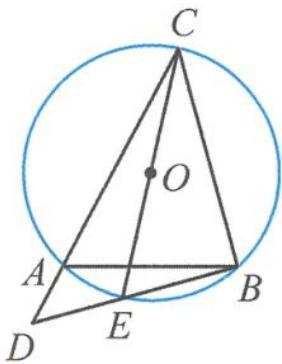
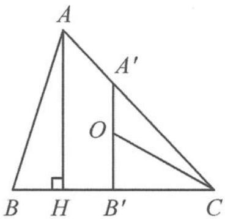

> [!faq]- 《高中数学新体系·向量的秘密》参考答案
>
> > [!success]- **【答案】** D
>
> > [!note]- **【分析】**
> > 本题未单列分析。
>
> > [!note]- **【解析】**
> > 解答 解法一: 因为 $\overrightarrow{CO} = \frac{3}{4} t \left( \frac{4}{3} \overrightarrow{CA} \right) + \left( \frac{1}{2} - \frac{3}{4} t \right) \overrightarrow{CB}$ ,
> > $$
> > 2 \overrightarrow {C O} = \frac {3}{2} t \left(\frac {4}{3} \overrightarrow {C A}\right) + \left(1 - \frac {3}{2} t\right) \overrightarrow {C B}.
> > $$
> > 故 $\overrightarrow{CE} = \frac{3}{2} t\overrightarrow{CD} +\left(1 - \frac{3}{2} t\right)\overrightarrow{CB}$ （点 $A$ 为 $CD$ 的四等分点），
> > 故 D, E, B 三点共线.
> > 
> > 第10题答图1
> > 如答图1,因为CE是圆O的直径,故∠CBD $= \frac{\pi}{2}$ .
> > 在△BCD中,设AC=3x,AD=x,BC=y,
> > BD=z,
> > 则 $\begin{cases}\cos\angle BAC=-\cos\angle BAD,\\BC^{2}+BD^{2}=CD^{2},\end{cases}$ 即 $\begin{cases}\frac{4^{2}+(3x)^{2}-y^{2}}{2\times4\times3x}=-\frac{4^{2}+x^{2}-z^{2}}{2\times4\times x},\\y^{2}+z^{2}=16x^{2},\end{cases}$ 即 $\begin{cases}12x^{2}=y^{2}+3z^{2}-64,\\y^{2}+z^{2}=16x^{2},\end{cases}$ 即 $y^{2}+9z^{2}=256\geqslant6yz.$
> > 故 $yz \leqslant \frac{128}{3}$ , 所以 $S_{\triangle BCD} = \frac{yz}{2} \leqslant \frac{64}{3}$ ,
> > 所以 $S_{\triangle ABC}=\frac{3}{4}S_{\triangle BCD}\leqslant\frac{3}{4}\times\frac{64}{3}=16$
> > 当 $y=8\sqrt{2}$ , $z=\frac{8}{3}\sqrt{2}$ 时取到等号, 所以 $\triangle ABC$ 面积的最大值为 16. 故选 D.
> > 解法二: $\overrightarrow{CO}=t\overrightarrow{CA}+\left(\frac{1}{2}-\frac{3}{4}t\right)\overrightarrow{CB}=\frac{3}{2}t\cdot\frac{2\overrightarrow{CA}}{3}+\left(1-\frac{3}{2}t\right)\frac{\overrightarrow{CB}}{2}.$
> > 取 CA 靠近 A 的三等分点 $A'$ ，如答图 2.
> > 
> > 第10题答图2
> > BC 的中点为 $B'$ ，那么 $\overrightarrow{CO} = \frac{3}{2} t \overrightarrow{CA'} + (1 - \frac{3}{2} t) \overrightarrow{CB'}$ .
> > 因为外心 O 在 $A^{\prime}B^{\prime}$ 上, 所以 $A^{\prime}B^{\prime} \perp BC$ , 此时过点 A 作 BC 的垂线, 垂足为 H. 由 $A^{\prime}$ 为三等分点和 $B^{\prime}$ 为中点, 可以推得 H 为 BC 靠近点 B 的四等分点.
> > 设 $BC = 4t$ ，可得 $AH = \sqrt{16 - t^2}$ 那么 $S_{\triangle ABC} = \frac{1}{2}\cdot BC\cdot AH = 2t\sqrt{16 - t^2} =$ $2\sqrt{t^2(16 - t^2)}\leqslant 2\times \frac{t^2 + (16 - t^2)}{2} = 16,$ 当且仅当 $t = 2\sqrt{2}$ 时取到等号，所以△ABC面积的最大值为16.
> >
> > 故选 **D**.
