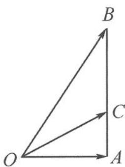
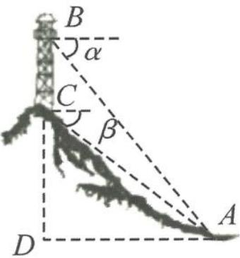

> [!faq]- 《高中数学新体系·向量的秘密》例题解析
>
> > [!success]- **【答案】** 详见解析
>
> > [!note]- **【分析】**
> > 目标 $\frac{b \cdot c}{|b||c|} = \cos \theta$ , 本题就是研究向量 $b$ 与 $c$ 的夹角.
>
> > [!note]- **【解析】**
> > 解答 如图 4.2-2, 记 $a = \overrightarrow{OA}, b = \overrightarrow{OB}, c = \overrightarrow{OC}$ , 由 $a \cdot b = a^2$ 得 $a \cdot (a - b) = 0$ , 即 $OA \perp AB$ , 点 $B$ 在 $OA$ 的垂线 $AB$ 上运动.
> > 
> > 由 $3c = 2a + b$ 可得 $c = \frac{2}{3} a + \frac{1}{3} b$ , 故点 $C$ 是 $AB$ 的三等分点. 又 $\frac{b \cdot c}{|b||c|} = \cos \angle BOC$ , 记 $|OA| = 1$ , 设 $|AB| = x$ , 则 $\tan \angle AOB = x, \tan \angle AOC = \frac{x}{3}$ . 所以
> > 图4.2-2
> > $$
> > \tan \angle B O C = \tan (\angle A O B - \angle A O C) = \frac {x - \frac {x}{3}}{1 + \frac {x ^ {2}}{3}} = \frac {2 x}{x ^ {2} + 3} \leqslant \frac {\sqrt {3}}{3}.
> > $$
> > 从而 $\angle BOC \leqslant \frac{\pi}{6}$ , 所以
> > $$
> > \frac {\boldsymbol {b} \cdot \boldsymbol {c}}{| \boldsymbol {b} | | \boldsymbol {c} |} = \cos \angle B O C \geqslant \frac {\sqrt {3}}{2}.
> > $$
> > 点评 本题用向量刻画了米勒问题(山高模型)中的仰角差,教材中的计算山高、塔高(图4.2-3)的问题就是这类问题的现实模型.在直角三角形中,利用仰角的正切值来研究仰角差比较便利.
> > 
> > 图4.2-3
