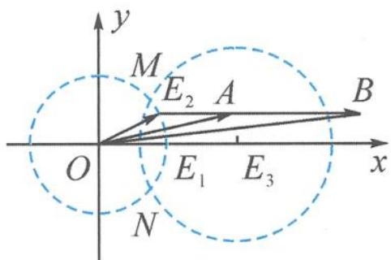

> [!faq]- 《高中数学新体系·向量的秘密》例题解析
>
> > [!success]- **【答案】** 详见解析
>
> > [!note]- **【分析】**
> > 本题未单列分析。
>
> > [!note]- **【解析】**
> > ## 解答 解法一:代数法
> > 由 $|2e_1 - e_2| \leqslant \sqrt{2}$ 平方得 $e_1 \cdot e_2 \geqslant \frac{3}{4}$ .
> > $$
> > \cos \theta = \frac {\boldsymbol {a} \cdot \boldsymbol {b}}{| \boldsymbol {a} | | \boldsymbol {b} |} = \frac {4 + 4 \boldsymbol {e} _ {1} \cdot \boldsymbol {e} _ {2}}{\sqrt {2 + 2 \boldsymbol {e} _ {1} \cdot \boldsymbol {e} _ {2}} \sqrt {1 0 + 6 \boldsymbol {e} _ {1} \cdot \boldsymbol {e} _ {2}}}.
> > $$
> > 设 $e_1 \cdot e_2 = x \in \left[\frac{3}{4}, 1\right]$ , 则
> > $$
> > \cos^ {2} \theta = \frac {(4 + 4 x) ^ {2}}{(2 + 2 x) (1 0 + 6 x)} = \frac {4 x + 4}{5 + 3 x} = \frac {4}{3} - \frac {8}{3 (5 + 3 x)}.
> > $$
> > 所以 $\cos^{2}\theta\in\left[\frac{28}{29},1\right]$ ，当 $x=\frac{3}{4}$ 时取最小值 $\frac{28}{29}$ .
> > 解法二: 几何法
> > 记 $e_1 = \overrightarrow{OE_1}, e_2 = \overrightarrow{OE_2}, 2e_1 = \overrightarrow{OE_3}$ . 因为 $|e_2| = 1$ , 所以 $E_2$ 在单位圆上. 又
> > $$
> > \left| 2 \boldsymbol {e} _ {1} - \boldsymbol {e} _ {2} \right| = \left| \overrightarrow {O E _ {3}} - \overrightarrow {O E _ {2}} \right| = \left| \overrightarrow {E _ {2} E _ {3}} \right| \leqslant \sqrt {2},
> > $$
> > 所以点 $E_{2}$ 在以 $E_{3}$ 为圆心， $\sqrt{2}$ 为半径的圆内，故点 $E_{2}$ 在圆弧 $\widehat{ME_{1}N}$ 上运动.
> > 记 $\overrightarrow{OA}=\boldsymbol{a}=\boldsymbol{e}_{1}+\boldsymbol{e}_{2},\overrightarrow{OB}=\boldsymbol{b}=3\boldsymbol{e}_{1}+\boldsymbol{e}_{2}$ ，如图4.2-8，A，B分别在过点 $E_{2}$ 且与 $OE_{1}$ 平行的直线上， $|\overrightarrow{E_{2}A}|=1,|\overrightarrow{E_{2}B}|=3$ ，则 $\theta=\angle AOB$ .
> > 
> > 图4.2-8
> > 记 $E_{2}(x,y)$ ，由山高模型知，
> > $$
> > \begin{array}{r l} \tan \theta & = \tan (\angle A O E _ {1} - \angle B O E _ {1}) = \frac {\frac {y}{x + 1} - \frac {y}{x + 3}}{1 + \frac {y}{x + 1} \times \frac {y}{x + 3}} = \frac {2 y}{(x + 1) (x + 3) + y ^ {2}} \\ & = \frac {1}{2} \times \frac {y}{x + 1} = \frac {1}{2} \times \frac {y - 0}{x - (- 1)}. \end{array}
> > $$
> > 要求 $\cos^{2}\theta$ 的最小值, 即求 $\tan\theta$ 最大时的 $\theta$ 值. 显然, 当点 $E_{2}$ 位于点 M 时,
> > $$
> > (\tan \theta) _ {\max} = \frac {1}{2} \times \frac {\frac {\sqrt {7}}{4} - 0}{\frac {3}{4} - (- 1)} = \frac {\sqrt {7}}{1 4}.
> > $$
> > 此时 $(\cos^{2}\theta)_{\min}=\frac{28}{29}.$
