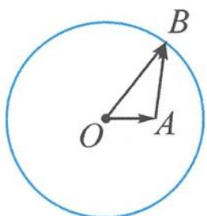

> [!faq]- 《高中数学新体系·向量的秘密》例题解析
>
> > [!success]- **【答案】** 详见解析
>
> > [!note]- **【分析】**
> > 本题未单列分析。
>
> > [!note]- **【解析】**
> > 解答 解法一:代数法
> > 设 a, b 的夹角为 $\theta$ ，则
> > $$
> > \vert \boldsymbol {b} - \boldsymbol {a} \vert = \sqrt {\boldsymbol {b} ^ {2} + \boldsymbol {a} ^ {2} - 2 \vert \boldsymbol {a} \vert \vert \boldsymbol {b} \vert \cos \theta} = \vert \boldsymbol {a} \vert \sqrt {5 - 4 \cos \theta},
> > $$
> > $$
> > \boldsymbol {b} \cdot (\boldsymbol {b} - \boldsymbol {a}) = \boldsymbol {b} ^ {2} - | \boldsymbol {a} | | \boldsymbol {b} | \cos \theta = 4 | \boldsymbol {a} | ^ {2} - 2 | \boldsymbol {a} | ^ {2} \cos \theta .
> > $$
> > 故 b 与 b-a 的夹角 $\alpha$ 的余弦值为
> > $$
> > \cos \alpha = \frac {\boldsymbol {b} \cdot (\boldsymbol {b} - \boldsymbol {a})}{| \boldsymbol {b} | | \boldsymbol {b} - \boldsymbol {a} |} = \frac {2 - \cos \theta}{\sqrt {5 - 4 \cos \theta}}.
> > $$
> > 令 $\sqrt{5 - 4\cos\theta} = t\in [1,3]$ ，则 $\cos \theta = \frac{5 - t^2}{4}$ 故
> > $$
> > \cos \alpha = \frac {2 - \frac {5 - t ^ {2}}{4}}{t} = \frac {t ^ {2} + 3}{4 t} \geqslant \frac {\sqrt {3}}{2}.
> > $$
> > 当且仅当 $t=\sqrt{3}$ ，即 $\cos\theta=\frac{1}{2}$ 时，取得等号，故 b 与 b-a 夹角的最大值为 $\frac{\pi}{6}$ .
> > 解法二: 几何法
> > 不妨取 $|a|=1$ , 则 $|b|=2$ , 记 $a=\overrightarrow{OA}, b=\overrightarrow{OB}$ , 则点 $B$ 在以 $O$ 为圆心, $2$ 为半径的圆上运动, 如图 4.2-9. $b$ 与 $b-a$ 的夹角即 $\overrightarrow{OB}$ 与 $\overrightarrow{AB}$ 的夹角 $\angle OBA$ . 在 $\triangle AOB$ 中, 由正弦定理知
> > $$
> > \frac {| \overrightarrow {O B} |}{\sin \angle O A B} = \frac {| \overrightarrow {O A} |}{\sin \angle O B A}.
> > $$
> > 故 $\sin \angle OBA = \frac{1}{2}\sin \angle OAB\leqslant \frac{1}{2}$ ，即
> > 
> > 图4.2-9
> > $$
> > \angle O B A \leqslant \frac {\pi}{6}.
> > $$
