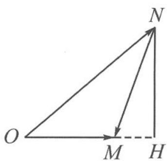
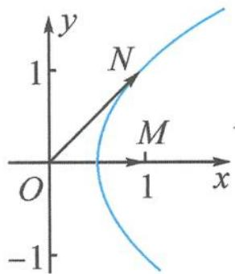
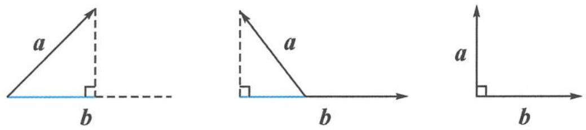

> [!faq]- 《高中数学新体系·向量的秘密》例题解析
>
> > [!success]- **【答案】** 详见解析
>
> > [!note]- **【分析】**
> > 本题未单列分析。
>
> > [!note]- **【解析】**
> > ## 解答 解法一: 几何法
> > 以大换小, 令 $m = \overrightarrow{OM}, n = \overrightarrow{ON}$ . 因为 $|m| = 1$ , 所以 $m \cdot n$ 即为向量 $n$ 在 $m$ 上的投影值. (考查投影概念中的一个形式 $n \cdot \frac{m}{|m|} = n \cdot m_0$ )
> > 故 $|m-n|=m\cdot n$ 即为 $|\overrightarrow{MN}|=|\overrightarrow{OH}|$ ，其中 $NH\perp OM$ 于点H，如图4.2-10.设 $|\overrightarrow{MN}|=|\overrightarrow{OH}|=x$ ，则 $|\overrightarrow{MH}|=|1-x|,\left|\overrightarrow{NH}\right|=\sqrt{x^{2}-(1-x)^{2}}=\sqrt{2x-1}$ ，故 $x\geqslant\frac{1}{2}$ .
> > 
> > $$
> > \tan \angle M O N = \frac {N H}{O H} = \frac {\sqrt {2 x - 1}}{x} = \sqrt {- \frac {1}{x ^ {2}} + \frac {2}{x}} = \sqrt {- \left(\frac {1}{x} - 1\right) ^ {2} + 1} \leqslant 1,
> > $$
> > 图4.2-10
> > 当且仅当 x=1，即 $NM \perp OM$ 时，向量 m, n 的夹角最大，此时 $|n|=\sqrt{2}$ .
> > 解法二： $\tan \langle m,n\rangle = \frac{NH}{OH} = \frac{NH}{MN} = \sin \angle NMH\leqslant 1$ ，故 $\langle m,n\rangle_{\mathrm{max}} = \frac{\pi}{4}$ 此时 $|\pmb {n}| = \sqrt{2}$
> > ## 解法三: 代数法
> > $|m-n|=m\cdot n$ 两边平方得 $n^{2}-2m\cdot n+1=(m\cdot n)^{2}$ ，即
> > $$
> > \boldsymbol {n} ^ {2} = (\boldsymbol {m} \cdot \boldsymbol {n}) ^ {2} + 2 \boldsymbol {m} \cdot \boldsymbol {n} - 1.
> > $$
> > 因为 $\cos \langle m, n \rangle = \frac{m \cdot n}{|m||n|}$ , 所以
> > $$
> > \cos^ {2} \langle m, n \rangle = \frac {(m \cdot n) ^ {2}}{| n | ^ {2}} = \frac {(m \cdot n) ^ {2}}{(m \cdot n) ^ {2} + 2 m \cdot n - 1}.
> > $$
> > 令 $m \cdot n = t$ ，则 $\cos^{2}\langle m, n\rangle = \frac{t^{2}}{t^{2} + 2t - 1} = \frac{1}{1 + \frac{2}{t} - \frac{1}{t^{2}}} = \frac{1}{-\left(\frac{1}{t} - 1\right)^{2} + 2} \geqslant \frac{1}{2}$ ，所以
> > $$
> > \cos \langle \boldsymbol {m}, \boldsymbol {n} \rangle \geqslant \frac {\sqrt {2}}{2}.
> > $$
> > 向量 m, n 的夹角最大为 $\frac{\pi}{4}$ ，此时 $m \cdot n = 1 \times |n| \times \frac{\sqrt{2}}{2} = 1$ ，故 $|n| = \sqrt{2}$ .
> > 解法四: $\cos\langle m,n\rangle=\cos\theta=\frac{m\cdot n}{|m||n|}=\frac{|m-n|}{|n|}$ ，即
> > $$
> > \cos^ {2} \theta = \frac {| m - n | ^ {2}}{| n | ^ {2}} = \frac {| n | ^ {2} - 2 m \cdot n + 1}{| n | ^ {2}} = \frac {| n | ^ {2} - 2 | n | \cos \theta + 1}{| n | ^ {2}},
> > $$
> > 整理得
> > $$
> > \cos^ {2} \theta + \frac {2}{| \boldsymbol {n} |} \cdot \cos \theta - \left(\frac {1}{| \boldsymbol {n} | ^ {2}} + 1\right) = 0.
> > $$
> > 所以 $\cos\theta=-\frac{1}{|n|}+\sqrt{\frac{2}{|n|^{2}}+1}\left(\cos\theta=-\frac{1}{|n|}-\sqrt{\frac{2}{|n|^{2}}+1}<-1\right)$ ，舍去）。令 $\frac{\sqrt{2}}{|n|}=$ tan α, 则
> > $$
> > \cos \theta = - \frac {\sqrt {2}}{2} \tan \alpha + \frac {1}{\cos \alpha} = \frac {- \sqrt {2} \sin \alpha + 2}{2 \cos \alpha} \geqslant \frac {\sqrt {2}}{2}.
> > $$
> > (这个函数也可以用求导的方式求解, 略) 当 $\sin \alpha = \cos \alpha = \frac{\sqrt{2}}{2}$ 时, 取得等号, 此时 $|n| = \sqrt{2}$ .
> > 解法五:设 $\left|n\right|=t,\langle m,n\rangle=\theta$ , 则 $m\cdot n=t\cos\theta$ 。由题意知 $t^{2}-2t\cos\theta+1=(t\cos\theta)^{2}$ ，即
> > $$
> > t ^ {2} \sin^ {2} \theta - 2 t \cos \theta + 1 = 0.
> > $$
> > 这是一个含有 $t, \theta$ 的二元方程，将其视为关于 $t$ 的一元二次方程，则方程有解满足
> > $$
> > (2 \cos \theta) ^ {2} - 4 \sin^ {2} \theta \geqslant 0,
> > $$
> > 即 $\tan \theta \leqslant 1, \theta \leqslant \frac{\pi}{4}$ . 所以, 向量 $m, n$ 的夹角最大为 $\frac{\pi}{4}$ , 此时 $t = |n| = \sqrt{2}$ .
> > 解法六: 解析法
> > 设 $m = (1,0), n = (x,y)$ ，则 $\sqrt{(x - 1)^2 + y^2} = x$ ，化简得
> > $$
> > y ^ {2} = 2 x - 1.
> > $$
> > 故 $n=\overrightarrow{ON}$ 的终点 N 落在抛物线 $y^{2}=2x-1$ 上，如图 4.2-11.
> > 显然, 当 ON 恰与抛物线相切时, $\angle MON$ 最大.
> > 
> > 设 $l_{ON}: y = kx$ ，与 $y^{2} = 2x - 1$ 联立，相切时得 k = 1，即向量 m, n 的夹角最大为 $\frac{\pi}{4}$ ，此时 $|n| = \sqrt{2}$ .
> > 图4.2-11
> > 当然,也可以结合解法一,根据抛物线到定点的距离等于到定直线距离的定义,得到抛物线方程.
> > 至此,向量的夹角问题得到了很好的解决. 向量作为数形结合的主阵地,处理问题的方法一般也有代数的数量积运算与几何的图形背景两个角度. 在日常的教学和学习中,只有不断加强两方面的研究,才能在数与形之间自由切换,收放自如.
> > 
