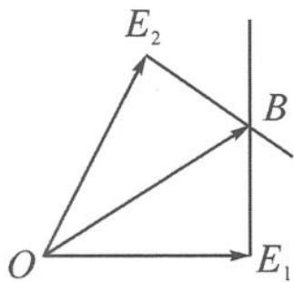

> [!faq]- 《高中数学新体系·向量的秘密》例题解析
>
> > [!success]- **【答案】** 详见解析
>
> > [!note]- **【分析】**
> > 本题未单列分析。
>
> > [!note]- **【解析】**
> > 解答 记 $e_1 = \overrightarrow{OE_1}, e_2 = \overrightarrow{OE_2}, b = \overrightarrow{OB}$ , 则 $\angle E_1OE_2 = 60^\circ$ . 向量 $b$ 在 $e_1, e_2$ 上的投影值均为 1, 即点 $B$ 恰为图 4.3-5 中 $OE_1$ 与 $OE_2$ 的垂线的交点. 因为 $\angle BOE_1 = 30^\circ, OE_1 = 1$ , 所以
> > $$
> > | \boldsymbol {b} | = | \overrightarrow {O B} | = \frac {2 \sqrt {3}}{3}.
> > $$
> > 
> > 图4.3-5
> > 点评 本题已知条件中隐含着两个投影值“ $b \cdot e_{i}$ ”，作图将投影几何化，有助于简化计算，提高直观想象的数学核心素养。
